# DSR v1 — Documentación funcional y flujo

Documento de **flujo end-to-end** del pipeline **Decision Support / DeepSeek** en su variante **v1**: jobs en Python, JSON en `out/`, llamadas HTTP a la API **OpenAI-compatible** de DeepSeek, y salida hacia merge → render → Telegram (y opcionalmente `persist_picks`).

**Alcance:** `jobs/` + `core/` relevantes. **Queda fuera** el camino BT2 (`apps/api/bt2_dsr_deepseek.py`), que replica la **semántica por lotes** pero vive en la API FastAPI.

**Relación con otras guías:** visión operativa general en [`docs/GUIA_OPERACION_Y_ARQUITECTURA.md`](../GUIA_OPERACION_Y_ARQUITECTURA.md) (§5); nombres de archivos bajo `out/` en [`openclaw/NAMING_ARTIFACTS.md`](../../openclaw/NAMING_ARTIFACTS.md).

---

## 1. Objetivo funcional

1. Para un **`daily_run`** (día + deporte), tener snapshots enriquecidos en BD (`event_features`).
2. Elegir **candidatos** aptos (Tier A/B) y serializar el contexto que necesita el modelo en **`ds_input[]`**.
3. Recortar por **ventana de kickoff** local (mañana / tarde) y **partir en lotes** para controlar tokens y timeouts.
4. Por cada lote, **una petición** a DeepSeek; el modelo devuelve JSON tipo **`picks_by_event`**.
5. Post-procesar (cuotas, conflictos selección/razón, umbrales), **unir partes**, **renderizar** mensaje y opcionalmente **persistir picks**.

---

## 2. Diagrama de flujo (alto nivel)

```mermaid
flowchart LR
  subgraph ingest_y_datos
    A[ingest_daily_events + persist_event_bundle]
    B[(SQLite event_features)]
    A --> B
  end

  subgraph candidatos
    C[select_candidates.py]
    D[candidates_DATE_select.json]
    B --> C --> D
  end

  subgraph ventana
    E[event_splitter.py]
    F[candidates_DATE_exec_08h o exec_16h.json]
    D --> E --> F
  end

  subgraph lotes
    G[split_ds_batches.py]
    H[out/batches/..._batchNNofMM.json]
    F --> G --> H
  end

  subgraph modelo
    I[deepseek_batches_to_telegram_payload_parts.py]
    J[API DeepSeek chat/completions]
    H --> I --> J
    I --> K[out/payload_DATE_exec_partNN.json]
  end

  subgraph salida
    L[merge_telegram_payload_parts.py]
    M[render_telegram_payload.py]
    N[Telegram / persist_picks]
    K --> L --> M --> N
  end
```

---

## 3. Fases, archivos y responsabilidades

| Fase | Archivo principal | Entrada | Salida / efecto |
|------|-------------------|---------|-----------------|
| **Datos por evento** | `core/event_bundle_scraper.py` | SofaScore (Playwright) | Bundle con `event_context`, `processed`, `diagnostics`. |
| **Persistencia features** | `jobs/persist_event_bundle.py` | Bundle | Filas en `event_features` (`features_json`) alineadas a `captured_at_utc` del run. |
| **Candidatos + `ds_input`** | `jobs/select_candidates.py` | `event_features` del run | JSON con `selected`, `candidates_detail`, **`ds_input[]`**, `run_inventory`, `ds_input_summary`. |
| **Contrato Tier A/B** | `core/candidate_contract.py` | — | Reglas compartidas con el selector (qué cuenta “candidato” y tier). |
| **Filtro horario** | `jobs/event_splitter.py` | Salida de `select_candidates` | Mismo esquema pero `ds_input` recortado a ventana **morning** / **afternoon** (kickoff local). |
| **Lotes para el LLM** | `jobs/split_ds_batches.py` | JSON post-splitter | Varios archivos con trozos de `ds_input` + metadatos `split_batches` (recomendado: `--slim`, `--chunk-size` 3–4). |
| **Llamada DeepSeek** | `jobs/deepseek_batches_to_telegram_payload_parts.py` | Glob de batches | `POST …/chat/completions` por archivo; partes de `telegram_payload`. |
| **Prompts tenis** | `core/tennis_deepseek_contract.py` | — | System / instrucciones usuario para deporte `tennis` (no hace HTTP). |
| **Post-cuotas / confianza** | `core/scraped_odds_anchor.py` | — | Umbrales alineados con la validación posterior en el job DeepSeek. |
| **Orquestación CLI** | `jobs/independent_runner.py` | Args + env | Encadena select → splitter → split_ds_batches → deepseek_batches (y opc. merge/render/telegram). |

**Procesadores** bajo `processors/` transforman respuestas crudas hacia las claves de `processed` (lineups, h2h, odds, tenis, etc.); no invocan DeepSeek.

**Fuente alternativa de `ds_input` (CDM):** `scripts/bt2_cdm/build_candidates.py` genera JSON **compatible** con el mismo job de DeepSeek sin modificar `deepseek_batches_to_telegram_payload_parts.py`.

---

## 4. Contrato de entrada al modelo: elemento de `ds_input`

Cada ítem del array **`ds_input`** (dentro del objeto `batch` que se serializa en el mensaje `user`) tiene esta forma **fija en el borde** (definida en `jobs/select_candidates.py`):

| Campo | Descripción breve |
|--------|-------------------|
| `event_id` | Identificador del evento (p. ej. SofaScore). |
| `sport` | Slug del run (`football`, `tennis`, …). |
| `selection_tier` | `A` (datos completos) o `B` (fallback). |
| `schedule_display` | `utc_iso`, `local_iso`, `timezone_reference`, etc. |
| `event_context` | Torneo, equipos/jugadores, `start_timestamp`, `match_state`, marcador si aplica, etc. (`core/event_bundle_scraper._safe_event_meta`). |
| `processed` | Bloques ya normalizados: p. ej. `lineups`, `statistics`, `h2h`, `team_streaks`, `team_season_stats`, `odds_all`, `odds_featured`; en tenis añade `tennis_odds`, `tennis_rankings`, etc. |
| `diagnostics` | Flags `*_ok` y `fetch_errors` (qué falló al scrapear). |

El **lote** que recibe el modelo es el JSON completo del archivo batch: metadatos (`job`, `daily_run_id`, `sport`, `split_batches`, …) + **`ds_input`** con varios eventos. En modo **`--slim`**, se omiten campos pesados (`run_inventory` completo, etc.) y queda lo mínimo para análisis.

Ejemplo sintético de un evento: `fixtures/ds_input_tier_B_synthetic.json` (añadir en runtime `sport` y `schedule_display` como hace `select_candidates`).

---

## 5. Llamada HTTP a DeepSeek (v1)

**Único módulo v1 que abre la red:** `jobs/deepseek_batches_to_telegram_payload_parts.py`.

- **URL:** `{base_url}/chat/completions` (default `https://api.deepseek.com`).
- **Cuerpo (resumen):** `model`, `messages` = `[{role: system, content}, {role: user, content}]`, `temperature`, `max_tokens`, `stream: false`, y salvo `--disable-response-format`, `response_format: { type: json_object }`.
- **Contenido del `user`:** instrucciones (fútbol inline en el job; tenis vía `core/tennis_deepseek_contract.py`) + línea **“Datos del lote (JSON):”** + **`json.dumps(batch)`** del archivo de lote.
- **Modelos típicos:** análisis `deepseek-reasoner` (CLI `--model`); fallback para convertir razonamiento → JSON: `deepseek-chat` (`DS_CHAT_MODEL` / `--chat-fallback-model`).
- **Variables de entorno habituales:** `DEEPSEEK_API_KEY` (nombre configurable con `--api-key-env`), `DS_CHAT_MODEL`, `DS_ANALYSIS_MODEL` / `DS_MODEL`, timeouts y reintentos en argparse del job.

Si el reasoner devuelve contenido útil solo en `reasoning_content`, el job puede hacer una **segunda** llamada (chat) para obtener JSON estricto (`_force_json_from_reasoning`).

---

## 6. Salida esperada del modelo

El modelo debe devolver un objeto JSON con **`picks_by_event`**: una fila por cada `event_id` presente en `ds_input` del lote, con `picks[]` (máx. 2 por evento en el contrato actual), `motivo_sin_pick`, campos `market`, `selection`, `odds`, `edge_pct`, `confianza`, `razon`, etc. El job valida, enriquece y convierte a partes consumibles por `merge_telegram_payload_parts.py` → `render_telegram_payload.py`.

Detalle de reglas en el propio `jobs/deepseek_batches_to_telegram_payload_parts.py` (`_build_user_prompt`, `_build_payload_from_batch`).

---

## 7. Artefactos en disco (convención)

| Patrón | Producido por |
|--------|----------------|
| `out/candidates_{DATE}_select.json` | `select_candidates.py` |
| `out/candidates_{DATE}_exec_08h.json` / `_exec_16h.json` | `event_splitter.py` |
| `out/batches/candidates_{DATE}_exec_*_batchNNofMM.json` | `split_ds_batches.py` |
| `out/payload_{DATE}_{EXEC}_partNN.json` | `deepseek_batches_to_telegram_payload_parts.py` |

Ver tabla completa en `openclaw/NAMING_ARTIFACTS.md`.

---

## 8. Nota: BT2 / “DSR v1-equivalente” en API

Con `BT2_DSR_PROVIDER=deepseek`, FastAPI agrupa candidatos en lotes y llama a DeepSeek desde **`apps/api/bt2_dsr_deepseek.py`** (`deepseek_suggest_batch`), con un **`ds_input` mínimo** (cuotas + nombres) distinto del bundle completo del job v1. La **semántica** (lote + `picks_by_event`) está alineada a propósito con v1; la **implementación** y persistencia son BT2.

---

## 9. Referencias rápidas en código

| Tema | Ruta |
|------|------|
| Construcción `ds_input[]` | `jobs/select_candidates.py` |
| HTTP DeepSeek v1 | `jobs/deepseek_batches_to_telegram_payload_parts.py` (`_call_deepseek_chat`) |
| Ensamblado `processed` | `core/event_bundle_scraper.py` |
| DeepSeek BT2 (no v1 job) | `apps/api/bt2_dsr_deepseek.py`, orquestación en `apps/api/bt2_router.py` |

---

*Última alineación: flujo descrito respecto al código en `jobs/` y `core/` del repositorio ALTEA / scrapper.*
