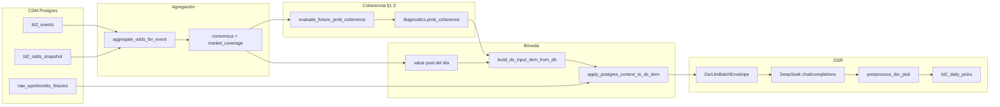
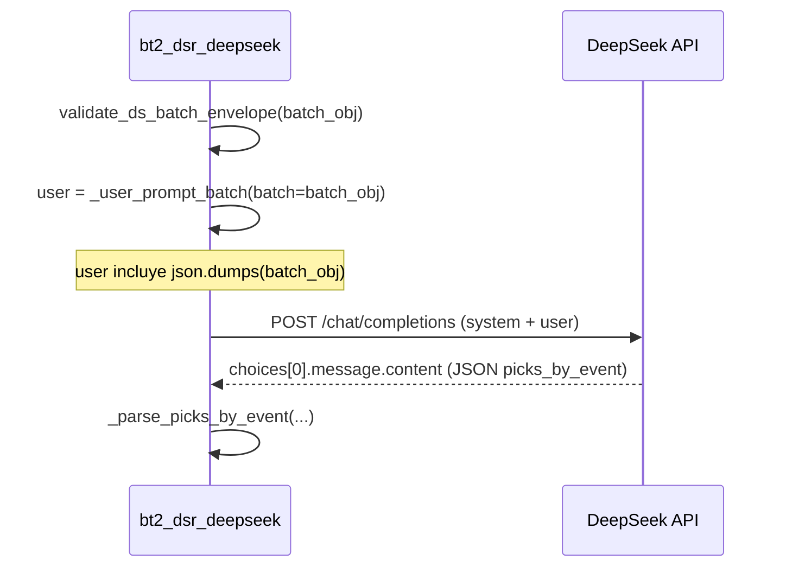

# Flujo real: fixture → candidato → `ds_input` → DSR → respuesta

**Propósito:** una sola lectura con **datos que salen del código actual** (mismo pipeline que producción), más el **envelope completo** que ve DeepSeek.

**Evento anclado** (metadatos tomados del inventario `out/run_2026-04-17_bt2_sm_only.json`)

| Campo | Valor |
|--------|--------|
| `bt2_event_id` | `102656` |
| `sportmonks_fixture_id` | `19425514` |
| Partido | **Katowice vs Motor Lublin** |
| Liga | **Ekstraklasa** |
| Estado en ese run | `scheduled` |

Las **cuotas** del ejemplo son **sintéticas** (filas tipo CDM: Bet365/Pinny) pero pasan por **`classify_snapshot_row`** → **`aggregate_odds_for_event`** → **`build_ds_input_item`** igual que en vivo. En tu máquina, sustituye por filas reales de `bt2_odds_snapshot`.

**Contrato / pipeline:** `PIPELINE_VERSION_DEFAULT` = `s6-rules-v0`; versión pública DX `bt2-dx-001-s6.2r3` (`bt2_dsr_contract.py`).

---

## Índice

| § | Contenido |
|---|-----------|
| 1 | Flujo real paso a paso (tabla) |
| 2 | Diagramas (pipeline + llamada HTTP) |
| 3 | Fixture CDM |
| 4 | Candidato (pool / snapshot) |
| 5 | Coherencia → `diagnostics.prob_coherence` |
| 6 | **`ds_input` completo** (un evento) |
| 7 | **`DsrLlmBatchEnvelope` completo** + cómo lo recibe el modelo |
| 8 | Respuesta `picks_by_event` + qué hace el backend |
| 9 | Reproducir en local |

---

## 1. Flujo real paso a paso

| Paso | Qué ocurre | Entrada principal | Salida / dónde queda |
|------|------------|-------------------|----------------------|
| 1 | Identificación del partido | `bt2_events.id`, joins equipos/liga | Fila evento + `kickoff_utc`, `status` |
| 2 | Ingesta de cuotas | Filas `bt2_odds_snapshot` (`bookmaker`, `market`, `selection`, `odds`, …) | Lista de filas crudas por `event_id` |
| 3 | Clasificación | `classify_snapshot_row` | Pares `(market_canonical, selection_canonical)` |
| 4 | Agregación | `aggregate_odds_for_event` | `AggregatedOdds`: `consensus`, `market_coverage`, `by_bookmaker`, `markets_available` |
| 5 | Coherencia §1.3 | `evaluate_fixture_prob_coherence(consensus)` | Objeto `prob_coherence` (dict) |
| 6 | Builder DSR | `build_ds_input_item` / `build_ds_input_item_from_db` | Un ítem que valida como `DsInputItem` (`validate_ds_input_item_dict`) |
| 7 | Contexto SM (opcional) | `apply_postgres_context_to_ds_item` | Enriquece `processed.*` y `diagnostics.*` desde Postgres |
| 8 | Armar lote | `deepseek_suggest_batch` | `DsrLlmBatchEnvelope`: `operating_day_key`, `pipeline_version`, `sport`, `ds_input[]` |
| 9 | Prompt | `_user_prompt_batch` | Texto usuario = instrucciones + **`json.dumps(batch)`** (incluye **todo** `diagnostics.prob_coherence`) |
| 10 | HTTP | POST `chat/completions` | Respuesta JSON del modelo → `_parse_picks_by_event` → post-proceso → persistencia |

**Puntos clave:** no existe un servicio aparte para coherencia: vive en **`diagnostics.prob_coherence`** dentro de cada elemento de `ds_input`. El LLM la lee porque el **user prompt incluye el JSON serializado del batch completo**.

---

## 2. Diagramas

### 2.1 Pipeline de datos



### 2.2 Llamada al modelo (una petición por lote)



---

## 3. Fixture en CDM (`bt2_events`)

| Idea | Ejemplo |
|------|---------|
| `id` | `102656` |
| `sportmonks_fixture_id` | `19425514` |
| Equipos / liga | Via `bt2_teams`, `bt2_leagues` → nombres mostrados en `event_context` |

El JSON crudo SportMonks **no** va entero en `ds_input`; el builder usa tablas/raw para opcionalmente rellenar `processed.lineups`, estadísticas, etc.

---

## 4. De fixture a candidato (pool / snapshot)

1. Filas de `bt2_odds_snapshot` por `event_id`.
2. `aggregate_odds_for_event` → medianas por pierna → **`consensus`**.
3. **`market_coverage`** por mercado whitelist.
4. Pool valor / reglas F2 según producto.

En el run del 17, para este `event_id` el inventario decía esencialmente: solo **FT_1X2** completo en ese snapshot; el ejemplo de más abajo **añade BTTS sintético** para mostrar también `markets_available` y `prob_coherence` con más de un mercado en `consensus`.

---

## 5. Coherencia → `diagnostics.prob_coherence`

- **Código:** `apps/api/bt2_fixture_prob_coherence.py` → `evaluate_fixture_prob_coherence`.
- **Contrato:** `DsProbCoherenceDiagnostics` dentro de `DsDiagnosticsF1.prob_coherence` (`bt2_dsr_contract.py`).
- **Inyección:** `build_ds_input_item` llama a `prob_coherence_dict_for_ds_input(agg.consensus)` y lo coloca en `diagnostics`.
- **DSR:** el modelo ve el mismo dict dentro del JSON del lote (no hay campo HTTP extra).

Flags: `coherence_ok` | `coherence_warning` | `coherence_na`. No bloquean picks por defecto.

---

## 6. `ds_input` completo (salida literal del builder)

Generado con:

`build_ds_input_item(..., agg=aggregate_odds_for_event(rows, min_decimal=1.30))`

```json
{
  "event_id": 102656,
  "sport": "football",
  "selection_tier": "A",
  "schedule_display": {
    "utc_iso": "2026-04-17T16:00:00Z",
    "timezone_reference": "UTC"
  },
  "event_context": {
    "league_name": "Ekstraklasa",
    "home_team": "Katowice",
    "away_team": "Motor Lublin",
    "match_state": "scheduled",
    "country": "Poland",
    "league_tier": "A",
    "start_timestamp_unix": 1776441600
  },
  "processed": {
    "odds_featured": {
      "consensus": {
        "FT_1X2": {
          "home": 2.15,
          "draw": 3.4,
          "away": 3.5
        },
        "BTTS": {
          "yes": 1.88,
          "no": 1.95
        }
      },
      "by_bookmaker": [
        {
          "bookmaker": "Bet365",
          "market_canonical": "FT_1X2",
          "selection_canonical": "home",
          "decimal": 2.15,
          "fetched_at": "2026-04-17T16:00:00+00:00"
        },
        {
          "bookmaker": "Bet365",
          "market_canonical": "FT_1X2",
          "selection_canonical": "draw",
          "decimal": 3.4,
          "fetched_at": "2026-04-17T16:00:00+00:00"
        },
        {
          "bookmaker": "Bet365",
          "market_canonical": "FT_1X2",
          "selection_canonical": "away",
          "decimal": 3.5,
          "fetched_at": "2026-04-17T16:00:00+00:00"
        },
        {
          "bookmaker": "Pinny",
          "market_canonical": "BTTS",
          "selection_canonical": "yes",
          "decimal": 1.88,
          "fetched_at": "2026-04-17T16:00:00+00:00"
        },
        {
          "bookmaker": "Pinny",
          "market_canonical": "BTTS",
          "selection_canonical": "no",
          "decimal": 1.95,
          "fetched_at": "2026-04-17T16:00:00+00:00"
        }
      ]
    },
    "lineups": {
      "available": false
    },
    "h2h": {
      "available": false
    },
    "statistics": {
      "available": false
    },
    "team_streaks": {
      "available": false
    },
    "team_season_stats": {
      "available": false
    },
    "fixture_conditions": {
      "available": false
    },
    "match_officials": {
      "available": false
    },
    "squad_availability": {
      "available": false
    },
    "tactical_shape": {
      "available": false
    },
    "prediction_signals": {
      "available": false
    },
    "broadcast_notes": {
      "available": false
    },
    "fixture_advanced_sm": {
      "available": false
    }
  },
  "diagnostics": {
    "market_coverage": {
      "FT_1X2": true,
      "OU_GOALS_2_5": false,
      "BTTS": true,
      "OU_GOALS_1_5": false,
      "OU_GOALS_3_5": false,
      "DOUBLE_CHANCE_1X": false,
      "DOUBLE_CHANCE_X2": false,
      "DOUBLE_CHANCE_12": false
    },
    "lineups_ok": false,
    "h2h_ok": false,
    "statistics_ok": false,
    "fetch_errors": [],
    "raw_fixture_missing": false,
    "team_season_stats_reason": null,
    "prob_coherence": {
      "flag": "coherence_warning",
      "ft_1x2_implied_sum_raw": 1.044948,
      "ft_1x2_book_spread_ratio": 1.627907,
      "ou_25_implied_sum_raw": null,
      "notes": [
        "ft_1x2_book_spread_ratio_above_threshold"
      ]
    },
    "markets_available": [
      "BTTS",
      "FT_1X2"
    ]
  }
}
```

Tras **`apply_postgres_context_to_ds_item`** en producción, pueden cambiar bloques `processed.*` y flags en `diagnostics` (p. ej. `lineups_ok`, `ingest_meta` en odds).

---

## 7. Envelope del lote + cómo lo recibe DeepSeek

### 7.1 Objeto completo enviado a validación (`validate_ds_batch_envelope`)

Es el mismo objeto que termina incrustado en el user prompt (campo lógico `batch` en `_user_prompt_batch`):

```json
{
  "operating_day_key": "2026-04-17",
  "pipeline_version": "s6-rules-v0",
  "sport": "football",
  "ds_input": [
    {
      "event_id": 102656,
      "sport": "football",
      "selection_tier": "A",
      "schedule_display": {
        "utc_iso": "2026-04-17T16:00:00Z",
        "timezone_reference": "UTC"
      },
      "event_context": {
        "league_name": "Ekstraklasa",
        "home_team": "Katowice",
        "away_team": "Motor Lublin",
        "match_state": "scheduled",
        "country": "Poland",
        "league_tier": "A",
        "start_timestamp_unix": 1776441600
      },
      "processed": {
        "odds_featured": {
          "consensus": {
            "FT_1X2": {
              "home": 2.15,
              "draw": 3.4,
              "away": 3.5
            },
            "BTTS": {
              "yes": 1.88,
              "no": 1.95
            }
          },
          "by_bookmaker": [
            {
              "bookmaker": "Bet365",
              "market_canonical": "FT_1X2",
              "selection_canonical": "home",
              "decimal": 2.15,
              "fetched_at": "2026-04-17T16:00:00+00:00"
            },
            {
              "bookmaker": "Bet365",
              "market_canonical": "FT_1X2",
              "selection_canonical": "draw",
              "decimal": 3.4,
              "fetched_at": "2026-04-17T16:00:00+00:00"
            },
            {
              "bookmaker": "Bet365",
              "market_canonical": "FT_1X2",
              "selection_canonical": "away",
              "decimal": 3.5,
              "fetched_at": "2026-04-17T16:00:00+00:00"
            },
            {
              "bookmaker": "Pinny",
              "market_canonical": "BTTS",
              "selection_canonical": "yes",
              "decimal": 1.88,
              "fetched_at": "2026-04-17T16:00:00+00:00"
            },
            {
              "bookmaker": "Pinny",
              "market_canonical": "BTTS",
              "selection_canonical": "no",
              "decimal": 1.95,
              "fetched_at": "2026-04-17T16:00:00+00:00"
            }
          ]
        },
        "lineups": {
          "available": false
        },
        "h2h": {
          "available": false
        },
        "statistics": {
          "available": false
        },
        "team_streaks": {
          "available": false
        },
        "team_season_stats": {
          "available": false
        },
        "fixture_conditions": {
          "available": false
        },
        "match_officials": {
          "available": false
        },
        "squad_availability": {
          "available": false
        },
        "tactical_shape": {
          "available": false
        },
        "prediction_signals": {
          "available": false
        },
        "broadcast_notes": {
          "available": false
        },
        "fixture_advanced_sm": {
          "available": false
        }
      },
      "diagnostics": {
        "market_coverage": {
          "FT_1X2": true,
          "OU_GOALS_2_5": false,
          "BTTS": true,
          "OU_GOALS_1_5": false,
          "OU_GOALS_3_5": false,
          "DOUBLE_CHANCE_1X": false,
          "DOUBLE_CHANCE_X2": false,
          "DOUBLE_CHANCE_12": false
        },
        "lineups_ok": false,
        "h2h_ok": false,
        "statistics_ok": false,
        "fetch_errors": [],
        "raw_fixture_missing": false,
        "team_season_stats_reason": null,
        "prob_coherence": {
          "flag": "coherence_warning",
          "ft_1x2_implied_sum_raw": 1.044948,
          "ft_1x2_book_spread_ratio": 1.627907,
          "ou_25_implied_sum_raw": null,
          "notes": [
            "ft_1x2_book_spread_ratio_above_threshold"
          ]
        },
        "markets_available": [
          "BTTS",
          "FT_1X2"
        ]
      }
    }
  ]
}
```

### 7.2 Transporte al modelo

1. `deepseek_suggest_batch` construye `batch_obj` con `operating_day_key`, `pipeline_version`, `sport`, `ds_input`.
2. `validate_ds_batch_envelope(batch_obj)` (whitelist T-172).
3. `user_prompt = _user_prompt_batch(operating_day_key=..., batch=batch_obj)` → al final: **`Datos del lote (JSON):` + `json.dumps(batch_obj, ensure_ascii=False)`**.
4. **System:** `_SYSTEM_BATCH` (incluye instrucciones sobre `diagnostics.prob_coherence`).
5. **POST** al endpoint configurado (`bt2_settings`), cuerpo OpenAI-compatible `chat/completions`.

**Ruta JSON dentro del texto que lee el LLM:** raíz del objeto en el user message → `ds_input` → `[índice]` → `diagnostics` → `prob_coherence`.

---

## 8. Respuesta del modelo + backend

El modelo debe devolver un único JSON con **`picks_by_event`** (un elemento por cada `event_id` del lote). Ejemplo ilustrativo:

```json
{
  "picks_by_event": [
    {
      "event_id": 102656,
      "motivo_sin_pick": "",
      "picks": [
        {
          "market": "FT_1X2",
          "selection": "home",
          "odds": 2.15,
          "edge_pct": 3.5,
          "confianza": "Media",
          "razon": "Ejemplo ilustrativo coherente con consensus y datos enviados."
        }
      ]
    }
  ]
}
```

**Backend:** `bt2_dsr_deepseek._parse_picks_by_event` → tuplas por evento → `normalized_pick_to_canonical` → post-proceso (`postprocess_dsr_pick`) → persistencia en **`bt2_daily_picks`** (narrativa, confianza, mercado/selección canónicos, odds de referencia, hash del input, etc.).

---

## 9. Reproducir el flujo en local

### 9.1 Ítem `ds_input` (igual que §6)

```bash
./.venv/bin/python3 -c "
from datetime import datetime, timezone
import json
from apps.api.bt2_dsr_odds_aggregation import aggregate_odds_for_event
from apps.api.bt2_dsr_ds_input_builder import build_ds_input_item

ko = datetime(2026, 4, 17, 16, 0, 0, tzinfo=timezone.utc)
rows = [
    ('Bet365', 'Full Time Result', '1', 2.15, ko),
    ('Bet365', 'Full Time Result', 'X', 3.40, ko),
    ('Bet365', 'Full Time Result', '2', 3.50, ko),
    ('Pinny', 'Both Teams To Score', 'Yes', 1.88, ko),
    ('Pinny', 'Both Teams To Score', 'No', 1.95, ko),
]
agg = aggregate_odds_for_event(rows, min_decimal=1.30)
item = build_ds_input_item(
    event_id=102656, selection_tier='A', kickoff_utc=ko, event_status='scheduled',
    league_name='Ekstraklasa', country='Poland', league_tier='A',
    home_team='Katowice', away_team='Motor Lublin', agg=agg,
)
print(json.dumps(item, indent=2, ensure_ascii=False, default=str))
"
```

### 9.2 Envelope del lote + validación (igual que §7)

```bash
./.venv/bin/python3 -c "
from datetime import datetime, timezone
import json
from apps.api.bt2_dsr_contract import PIPELINE_VERSION_DEFAULT, validate_ds_batch_envelope
from apps.api.bt2_dsr_odds_aggregation import aggregate_odds_for_event
from apps.api.bt2_dsr_ds_input_builder import build_ds_input_item

ko = datetime(2026, 4, 17, 16, 0, 0, tzinfo=timezone.utc)
rows = [
    ('Bet365', 'Full Time Result', '1', 2.15, ko),
    ('Bet365', 'Full Time Result', 'X', 3.40, ko),
    ('Bet365', 'Full Time Result', '2', 3.50, ko),
    ('Pinny', 'Both Teams To Score', 'Yes', 1.88, ko),
    ('Pinny', 'Both Teams To Score', 'No', 1.95, ko),
]
agg = aggregate_odds_for_event(rows, min_decimal=1.30)
item = build_ds_input_item(
    event_id=102656, selection_tier='A', kickoff_utc=ko, event_status='scheduled',
    league_name='Ekstraklasa', country='Poland', league_tier='A',
    home_team='Katowice', away_team='Motor Lublin', agg=agg,
)
batch = {
    'operating_day_key': '2026-04-17',
    'pipeline_version': PIPELINE_VERSION_DEFAULT,
    'sport': 'football',
    'ds_input': [item],
}
validate_ds_batch_envelope(batch)
print(json.dumps(batch, indent=2, ensure_ascii=False, default=str))
"
```

### 9.3 Desde Postgres (datos reales)

```python
build_ds_input_item_from_db(cur, 102656, selection_tier="A")
```

Requiere `BT2_DATABASE_URL` y tablas CDM pobladas.

---

*Los JSON de §6 y §7 coinciden con la salida de los scripts §9 en el mismo commit del repo; si cambian umbrales o el builder, vuelve a ejecutar los scripts y sustituye los bloques.*
