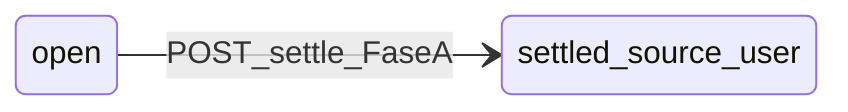

# Sprint 05 — US

> **Convención:** FE continúa en **US-FE-031+** (Sprint 04 cerró en US-FE-030). BE continúa en **US-BE-017+** (Sprint 04 cerró en US-BE-016). **Ampliación Sprint 05 (img5–7 + protocolo):** **US-FE-035 … US-FE-039**, **US-BE-020 … US-BE-023** + **extensión US-BE-018 §9**; decisiones **D-05-012 … D-05-019** y proceso **D-05-017**. **T-169** — bóveda anti-stale + labels (**D-05-019**).  
> **Calendario motor:** DSR, cron CDM, analytics amplio → **Sprint 06**; parlays y diagnóstico longitudinal → **Sprint 07** — ver [`DECISIONES.md`](./DECISIONES.md) **D-05-001** y [`PLAN.md`](./PLAN.md).

## Estado del sprint

- Fecha inicio / fin: *(definir)*  
- Estado: **Planned**  
- **US-BE-017, US-BE-018, US-DX-001, US-BE-019:** cuerpo completo; **T-131–T-133** y **T-141** cerradas en código (bóveda con `kickoffUtc` / `eventStatus`).
- **US-FE-034:** integridad de datos V2; T-134–T-140 cerradas en FE; hora bóveda alimentada por **T-141**.
- **Paquete D-05-012 … D-05-016:** contratos **US-BE-020…023** y **US-BE-018 §9** cerrados en documentación; implementación código pendiente según **T-142–T-152**.
- **Handoff BA/PM Backend:** [`HANDOFF_BA_PM_BACKEND_SPRINT05.md`](./HANDOFF_BA_PM_BACKEND_SPRINT05.md) (checklist completado para rectificación documental). **D-05-017** en [`DECISIONES.md`](./DECISIONES.md).

## Resumen — US Frontend

| ID | Título | Notas |
|----|--------|--------|
| US-FE-031 | UI de movimientos DP (`GET /bt2/user/dp-ledger`) | Arrastra intención de **T-124** (Sprint 04). |
| US-FE-032 | Hidratar ledger y métricas V2 desde `GET /bt2/picks` | Libro mayor, rendimiento, cierre del día alineados a servidor. |
| US-FE-033 | Compromiso explícito con pick en bóveda y liquidación | Estados tomado/seleccionado; alinear con `POST /bt2/picks` en estándar si producto lo exige. |
| US-FE-034 | **[Cambio]** Integridad de datos V2: santuario, perfil, bóveda | Mocks, ranking, misiones; bóveda + **settlement dos fases**, CTAs en fila, filtro hora/evento (**D-05-006–010**). |
| US-FE-035 | **[Cambio]** DP liquidación: copy y cliente **+10 gestión** (won/lost/void) | US FE **completa** (no placeholder): **D-05-012**; módulos y pruebas en cuerpo §3–§9. |
| US-FE-036 | **[Cambio]** Pick **liquidado**: **Detalle** en card → **misma ruta settlement**, ficha solo lectura | **D-05-013**; no sustituir por salto a bóveda; ledger enlaza igual. |
| US-FE-037 | **[Nuevo]** Copy y UI: **recompensa por cerrar día** (+15/+20) | **D-05-014**; depende **US-BE-021**; Daily Review / cierre sesión. |
| US-FE-038 | **[Nuevo]** Liquidación **dual** (sistema vs operador): estados y flujos FE | **D-05-015**; depende **US-BE-022**; banderas `settlementVerificationMode`, avisos de discrepancia. |
| US-FE-039 | **[Nuevo]** Bankroll emulado: coherencia UI con modelo contable servidor | **D-05-016**; depende **US-BE-023**; stake, reserva percibida, sync bankroll. |

## Resumen — US Backend / contrato

| ID | Título | Notas |
|----|--------|--------|
| US-BE-017 | Ledger DP: **desbloqueo** premium + penalizaciones de gracia en servidor | **−50 DP** al **desbloquear** señal **premium** del snapshot (`pick_premium_unlock`); penalizaciones D-04-011 tras gracia; idempotencia por `reference_id`. |
| US-BE-018 | Resumen del día operativo + **extensión §9** ficha/lista pick (liquidado) | `GET /bt2/operating-day/summary`; **`GET /bt2/picks` / `GET /bt2/picks/{id}`** con `PickOut` ampliado (**D-05-013**, **T-152**). |
| US-DX-001 | Catálogo canónico: `reason` del ledger + mercados API + perfiles operador | Desbloquea copy FE en `dp-ledger` y validaciones; enum mercados **documentado** (normalización CDM dura → Sprint 06). **Refinamiento** tras **US-BE-020–021** y **T-144**: `pick_settle`, **`session_close_discipline`**, reserva de enums **settlement source** (**D-05-015** / **US-BE-022**). |
| US-BE-019 | Bóveda: `kickoffUtc` + `eventStatus` en `GET /bt2/vault/picks` | Hora de inicio en ISO para UI y validación cliente; `isAvailable` sigue siendo la regla canónica con el POST. |
| US-BE-020 | **[Cambio]** Settle: **+10 DP** para `won`, `lost` y `void` (`pick_settle`) | **D-05-012**; ver **US-BE-022** si se añade outcome declarado en trust. |
| US-BE-021 | **[Nuevo]** Recompensa DP al **cerrar sesión** | **D-05-014** + **D-05-018** (default **+20**); `reason=session_close_discipline`; **T-146**. |
| US-BE-022 | **[Nuevo]** Liquidación **dual**: validador + operador, precedencia, auditoría | **D-05-015**; impacto PnL/DP; sin doble bankroll. |
| US-BE-023 | **[Nuevo]** Bankroll emulado: mutaciones, mercado canónico, fuente de verdad | **D-05-016**; reserva al tomar opc.; alinear `market` settle con CDM. |

---

## Frontend

### US-FE-031 — Lista de movimientos DP en UI (`dp-ledger`)

#### 1) Objetivo de negocio

Que el operador vea **trazabilidad** de sus Discipline Points (acreditaciones y cargos) desde el **servidor**, no solo el saldo agregado.

#### 2) Alcance *(refinar)*

- Incluye: vista acordada (p. ej. Perfil o Ajustes); `GET /bt2/user/dp-ledger`; estados carga / vacío / error; formato legible de `reason` (mapeo copy si hace falta tras **US-DX-001**).
- Excluye: editar movimientos; lógica de negocio nueva en servidor (va en **US-BE-017** u otras).

#### 3) Dependencias

- Contrato estable de entradas ledger (**US-DX-001** / OpenAPI actual).

#### 10) Definition of Done

- [x] Criterios verificables acordados con BE tras cerrar **US-DX-001**.
- [x] Tareas **T-126+** en [`TASKS.md`](./TASKS.md).

---

### US-FE-032 — Ledger y métricas V2 desde API (`GET /bt2/picks`)

#### 1) Objetivo de negocio

**Una sola fuente de verdad** para picks del usuario: abiertos, liquidados, PnL y DP por liquidación reflejados desde BD, con persistencia local solo como caché o transición.

#### 2) Alcance *(refinar)*

- Incluye: hidratar `useTradeStore` (o equivalente) al iniciar sesión y tras mutaciones; `LedgerPage`, `PerformancePage`, `DailyReviewPage` consumiendo datos derivados del servidor donde aplique; manejo de usuario sin picks.
- Excluye: motor DSR o cambios al snapshot diario CDM (**Sprint 06**).

#### 3) Dependencias

- Respuesta `GET /bt2/picks` / detalle con shape **US-BE-018 §9** (`earnedDp`, marcador, etc.); **`GET /bt2/operating-day/summary`** para agregados del día.

#### 10) Definition of Done

- [x] Documentado en `TASKS.md`; smoke manual vs BD.

---

### US-FE-033 — Compromiso explícito con pick (bóveda + liquidación)

#### 1) Objetivo de negocio

Evitar que la bóveda sea solo “catálogo → liquidación” sin **marca operativa** de qué pick está en juego; alinear con protocolo de disciplina.

#### 2) Alcance *(refinar)*

- Incluye: interacción UI (p. ej. “Tomar señal” en estándar si producto exige paridad con premium); estados visibles; reglas con **POST /bt2/picks** según decisión conjunta.
- Excluye: parlays (**Sprint 07**).

#### 3) Dependencias

- **US-BE-017** cubre el **cargo −50 por desbloqueo premium**, no el compromiso estándar; si el flujo estándar debe registrar pick en servidor al “comprometer”, se define aparte (mismo o otro endpoint).

#### 10) Definition of Done

- [x] Criterios Given/When/Then acordados con PM + BE; tareas en `TASKS.md`.
- Enmiendas posteriores (datos mock / bóveda): ver **US-FE-034**.

---

### US-FE-034 — [Cambio] Integridad de datos V2: santuario, perfil y bóveda (sin mocks creíbles)

#### 1) Objetivo de negocio

Que ninguna vista V2 muestre **números o rankings que parezcan oficiales** sin fuente (store/API) alineada al protocolo. El operador debe poder confiar en lo que ve o ver un estado **explícitamente vacío / no disponible**, no placeholders de diseño heredados del mock.

#### 2) Alcance

- **Incluye:**
  - **Santuario (`SanctuaryPage.tsx`):** eliminar literales **+14.2%** / **−4.2%** de crecimiento patrimonial y caída máxima; sustituir por valores derivados de **datos reales** (p. ej. `useBankrollStore` + historial / `GET /bt2/operating-day/summary` / ledger) o por **“—”** / **0%** con microcopy honesto cuando no haya historial suficiente (**D-05-006**).
  - **Santuario — misiones diarias:** eliminar constante **84%** y viñetas con estado simulado; mostrar **progreso calculado** solo si existen reglas cerradas en producto, o **estado vacío / “En definición”** con barra en 0 u oculta (**D-05-007**).
  - **Santuario — tarjeta “Estado: óptimo…”:** no afirmar salud conductual con copy fija si no hay señal (diagnóstico, sesión, ledger); usar copy **neutral** o condicionada (**D-05-007**).
  - **Perfil (`ProfilePage.tsx`):** eliminar fórmula decorativa **Top (100 − DP/50)%** como “posición global”; sustituir por **“Sin ranking en MVP”** / **—** o por dato **solo** si BE expone percentil real (**D-05-008**).
  - **Bóveda (`PickCard.tsx`, `VaultPage.tsx`, `SettlementPage` o ruta equivalente):** (a) **Hora en preview** desde **`kickoffUtc`** (ISO UTC → TZ usuario); si `""`, **—** (**D-05-009**, **D-05-011**). (b) **Etiqueta explícita** de estado (*Finalizado* / *En juego* / *No disponible*…) según **`eventStatus`** y **`isAvailable`**, no solo opacidad (**D-05-019**). (c) **Refetch** si cambia **día operativo** vs datos persistidos; usar **`operatingDayKey`** del DTO (**D-05-019**). (d) **Cartelera:** el BE no quita la tarjeta al liquidar; opcional badge **Liquidado** (**D-05-019** §4). (e) **Detalle** + **Tomar** en **una fila** (**D-05-010**). (f) **Detalle** → settlement revisión / liquidación. (g) Badge **En juego** / **Tomado**.
  - **Hora y campos de mercado:** **`kickoffUtc`**, **`eventStatus`**, **`isAvailable`**, **`operatingDayKey`** en **`Bt2VaultPickOut`** (**US-BE-019**); FE no inventa datos (**D-05-009**–**011**).
- **Excluye:**
  - Motor DSR, cron CDM (**Sprint 06**).
  - Endpoint real de “misiones diarias” o leaderboard global: si no existe, FE no inventa (**D-05-007**, **D-05-008**).

#### 3) Contexto técnico

- Archivos principales: `apps/web/src/pages/SanctuaryPage.tsx`, `apps/web/src/pages/ProfilePage.tsx`, `apps/web/src/components/vault/PickCard.tsx`, `apps/web/src/pages/VaultPage.tsx` (o equivalente de ruta bóveda).
- Tipos: `Bt2VaultPickOut` en `bt2Types.ts`; **US-BE-019** añade `kickoffUtc`, `eventStatus` (**D-05-011**).

#### 4) Contrato entrada/salida

- FE consume campos existentes de **`GET /bt2/vault/picks`**; ampliación de schema → **US-BE-019** + bump `contractVersion` si aplica.

#### 5) Reglas de dominio

- **Regla 1:** Ningún porcentaje de patrimonio, misión o ranking sin fuente documentada en código (comentario o constante nombrada `PLACEHOLDER` prohibida en UI de producción).
- **Regla 2:** `isAvailable === false` y/o `eventStatus` coherente con **finalizado / en juego** ⇒ card apagada, **sin** tomar, y **rótulo legible** (no solo opacidad) — **D-05-019**.
- **Regla 3:** **Detalle** no es modal duplicado: es **settlement** en modo **revisión** o **liquidación** (**D-05-010**).
- **Regla 4:** Preview en card no sustituye la pantalla de revisión; no ocultar en revisión campos que el API ya expone; **hora en preview** cuando `kickoffUtc` no esté vacío.
- **Regla 5:** Si el día operativo local ≠ `operatingDayKey` de los datos persistidos, **refetch** obligatorio (**D-05-019**).

#### 6) Criterios de aceptación (Given / When / Then)

1. Given usuario sin liquidaciones ni historial patrimonial suficiente, When abre Santuario, Then no aparecen **+14.2%** ni **−4.2%** como si fueran reales; aparece estado acordado (**D-05-006**).
2. Given mismo usuario, When ve bloque misiones, Then no aparece **84%** fijo ni checklist engañoso; aparece estado **D-05-007**.
3. Given usuario con 250 DP y sin API de ranking, When abre Perfil, Then no aparece “Top 95%” por fórmula **100 − dp/50** (**D-05-008**).
4. Given pick con `isAvailable: false` o evento terminado, When ve bóveda, Then card apagada y sin tomar (**D-05-010**).
5. Given pick estándar no tomado, When ve card, Then extracto de `traduccionHumana` y **Detalle** + **Tomar** **en la misma línea** (**D-05-010**).
6. Given pulsa **Detalle**, When carga la pantalla, Then es el **flujo settlement** en fase **revisión** con información suficiente (hora, mercado, selección, cuota, texto modelo) y CTA **Tomar** (**D-05-010**).
7. Given pick tomado y evento listo para cerrar, When opera liquidación, Then mismo flujo settlement en fase **liquidación** (**D-05-010**).
8. Given API devuelve `kickoffUtc` válido, When ve card, Then preview muestra **fecha/hora local** (no crudo ISO).
9. Given `eventStatus` finalizado o `isAvailable === false`, When ve card, Then hay **etiqueta** explícita de estado además del estilo apagado (**D-05-019**).
10. Given app cerrada con bóveda “loaded” del día **D** y al abrir es día **D+1**, When entra a bóveda, Then se dispara **nuevo** `GET /bt2/vault/picks` y no permanecen solo datos persistidos de **D** (**D-05-019**).

#### 7) No funcionales

- Coherencia Zurich Calm; `npm test` verde; sin regresión en desbloqueo premium (**D-05-004**).

#### 8) Riesgos

- **Cambio de percepción:** usuarios acostumbrados a ver “métricas” en santuario verán vacíos; mitigar con copy breve y educativo.
- **BE retrasado:** hora de evento bloqueada en **US-BE-019**; FE no bloquea el resto de **US-FE-034**.

#### 9) Plan de pruebas

- Manual: usuario nuevo / sin picks / pick `isAvailable` false / pick tomado.
- `npm test` `apps/web`.

#### 10) Definition of Done

- [x] Tareas **T-134–T-139** marcadas en [`TASKS.md`](./TASKS.md).
- [x] Tarea **T-140** (**D-05-010**: fila de CTAs, settlement dos fases, filtro hora/evento terminado).
- [x] **D-05-006–D-05-009** en [`DECISIONES.md`](./DECISIONES.md).
- [x] **D-05-010** en [`DECISIONES.md`](./DECISIONES.md).
- [ ] **T-169** — bóveda: **refetch al cambiar día** + **badges/labels** `eventStatus`/`isAvailable` + hora en preview (**D-05-019**); verificar contra red que no quede solo persistencia vieja.
- [ ] **Deuda img / PO:** detalle pick liquidado — **US-FE-036**, **D-05-013** (puede acoplarse a **T-145** / **T-152**).

---

## Backend

### US-BE-017 — Ledger DP en **desbloqueo** premium y penalizaciones de gracia (servidor)

#### 1) Objetivo de negocio

Que **toda mutación de saldo DP** relevante para el protocolo conductual quede en `bt2_dp_ledger`, de modo que `GET /bt2/user/dp-balance` y `GET /bt2/user/dp-ledger` sean la única fuente de verdad y el FE deje de compensar con `incrementDisciplinePoints` en flujos que ya pasan por API.

#### 2) Alcance

- Incluye:
  - **Nomenclatura (ver D-05-004):** el **−50 DP** es por **desbloquear** la señal premium del snapshot (`reason = pick_premium_unlock`), no por el acto abstracto de “tomar el pick”. En MVP el desbloqueo puede ir en el mismo paso técnico que crea la fila en `bt2_picks`.
  - **`POST /bt2/picks`:** si el `event_id` del cuerpo coincide con una fila de `bt2_daily_picks` para el mismo `user_id` y `operating_day_key` actual del usuario con `access_tier = 'premium'`, entonces **antes** de confirmar el pick: validar que `SUM(delta_dp)` del usuario sea **≥ 50** (coste canónico **D-04-011** para `pick_premium_unlock`; ver **D-05-002** si se parametriza en settings en el futuro). Tras insertar la fila en `bt2_picks`, insertar en `bt2_dp_ledger`: `delta_dp = -50`, `reason = 'pick_premium_unlock'`, `reference_id = id del pick recién creado`, `balance_after_dp` coherente con `_get_dp_balance` + esta fila.
  - Si el evento **no** está en el snapshot del día como premium (p. ej. pick manual / otro día), **no** aplicar cargo; el pick sigue siendo válido si el resto de reglas lo permiten.
  - **`POST /bt2/session/open`:** tras crear la sesión del día y el snapshot, ejecutar rutina **`_apply_grace_penalties`** (nombre interno libre) **idempotente**:
    - **`penalty_unsettled_picks` (−25):** para cada fila en `bt2_operating_sessions` del usuario con `status = 'closed'` y `grace_until_iso < now()` (UTC) para la que **aún no** exista en `bt2_dp_ledger` una fila con `reason = 'penalty_unsettled_picks'` y `reference_id = id de esa sesión`: si en el momento de evaluar existe **al menos un** `bt2_picks` con `status = 'open'` para ese usuario cuya `opened_at` es **anterior o igual** a `station_closed_at` de esa sesión, insertar una fila −25 con `reference_id = session.id`.
    - **`penalty_station_unclosed` (−50):** si el usuario abre sesión el día `D` (`operating_day_key = D`) y existe una sesión **previa** (mismo usuario) con `operating_day_key < D` (orden lexicográfico de fecha ISO) y `status = 'open'` (nunca cerrada), entonces: (1) cerrar esa sesión huérfana (`status = 'closed'`, `station_closed_at = now()`, `grace_until_iso = now()+24h` o `now()` según **D-05-002**); (2) insertar **una sola vez** por sesión huérfana un ledger `penalty_station_unclosed` −50 con `reference_id = id de esa sesión`, si no existe ya esa combinación reason+reference_id.
  - Transacciones DB: pick + ledger premium en la misma transacción; penalizaciones en la misma transacción que el `commit` de `session/open` o sub-transacción clara.
- Excluye:
  - Cambiar reglas de settle por liquidación — ver **D-05-012** / **US-BE-020** (enmienda Sprint 05).
  - Jobs cron; la aplicación de penalizaciones es **síncrona** al `session/open` (o al primer request que el equipo acuerde documentar en **D-05-002**).
  - Parlays y costes −25/−50 de parlay — Sprint 07.

#### 3) Contexto técnico actual

- Módulos: `apps/api/bt2_router.py` (`bt2_create_pick`, `bt2_session_open`), helpers `_get_dp_ledger_sum`, `_get_dp_balance`, `_operating_day_key_for_user`, `_append_dp_ledger_move`, `_close_orphan_sessions_and_station_penalties`, `_apply_grace_unsettled_penalties`; constantes `apps/api/bt2_dx_constants.py` (US-DX-001).
- Tablas: `bt2_picks`, `bt2_daily_picks`, `bt2_dp_ledger`, `bt2_operating_sessions`.
- **`POST /bt2/picks`:** si el `event_id` está en `bt2_daily_picks` como **premium** para el `operating_day_key` del usuario, en la **misma transacción** que el `INSERT` en `bt2_picks` se inserta en `bt2_dp_ledger` el movimiento **`pick_premium_unlock`** (`delta_dp = -50`, `reference_id = pick_id`). Saldo insuficiente → **402** con `detail` estructurado (**D-05-005**); el FE **no** debe compensar ese −50 en local.
- **`POST /bt2/session/open`:** antes de crear la sesión del día, aplica penalizaciones idempotentes (sesión huérfana abierta de día anterior → `penalty_station_unclosed`; gracia vencida con picks abiertos al cierre → `penalty_unsettled_picks`). Ver **D-05-002** y código en router.

#### 4) Contrato de entrada/salida

- **`POST /bt2/picks`:** sin cambio de shape del body. Códigos HTTP:
  - **402:** saldo DP insuficiente para **desbloquear** pick premium del snapshot (antes del cargo; ver **D-05-005**).
  - **422:** validación de body o reglas de evento (no “fondos”).
- **`POST /bt2/session/open`:** sin cambio de `SessionOpenOut` en MVP; opcional **Improvement** documentado en TASKS: campo `penaltiesApplied: []` en respuesta.

#### 5) Reglas de dominio

- Regla 1: El coste de **desbloqueo** premium es **−50** DP por cada desbloqueo que califique (en MVP: cada `POST /bt2/picks` exitoso sobre fila snapshot premium que dispare `pick_premium_unlock`).
- Regla 2: Idempotencia penalizaciones: **única** fila ledger por par (`reason`, `reference_id`) donde `reference_id` es el `id` de `bt2_operating_sessions` afectada.
- Regla 3: `balance_after_dp` en cada insert debe ser el saldo **después** de aplicar ese movimiento (mismo patrón que settle).
- Regla 4: Si falla el insert del pick, **no** debe quedar movimiento de ledger premium huérfano.

#### 6) Criterios de aceptación (Given / When / Then)

1. Given usuario con saldo DP &lt; 50 y pick premium en snapshot, When `POST /bt2/picks` para ese `event_id` (flujo que incluye desbloqueo), Then **402** con mensaje claro (**D-05-005**) y **no** se crea pick.
2. Given saldo ≥ 50 y evento premium en snapshot, When `POST /bt2/picks` (desbloqueo + creación de pick), Then pick 201 y ledger con `pick_premium_unlock` −50 y `reference_id = pick_id`.
3. Given evento no está en `bt2_daily_picks` premium hoy, When `POST /bt2/picks`, Then no cargo −50 aunque el FE marque premium en UI (servidor manda).
4. Given sesión cerrada con gracia vencida y pick abierto anterior al cierre, When `POST /bt2/session/open` siguiente, Then una fila `penalty_unsettled_picks` −25 con `reference_id = session_id` y segunda ejecución no duplica.
5. Given sesión día anterior aún `open`, When `POST /bt2/session/open` hoy, Then sesión huérfana cerrada y a lo sumo un −50 `penalty_station_unclosed` por esa sesión.
6. Given JWT ausente en cualquier endpoint, Then 401 (regresión).

#### 7) No funcionales

- Misma latencia objetivo que otros `POST` BT2 (< 300 ms local).
- Logs estructurados opcionales para auditoría de penalizaciones.

#### 8) Riesgos y mitigación

- **Riesgo:** orden de días y TZ — usar siempre `_operating_day_key_for_user` y comparaciones en UTC para `grace_until_iso`. **Mitigación:** pruebas manuales con TZ distinta a Bogotá.
- **Riesgo:** doble penalización si `session/open` se reintenta — **Mitigación:** comprobar ledger antes de insertar.

#### 9) Plan de pruebas

- Curl / script: escenarios §6; verificar `GET /bt2/user/dp-balance` y `dp-ledger` tras cada acción.
- `GET /health` V1 → `{"ok": true}`.

#### 10) Definition of Done

- [x] T-131 (US-BE-017) completada en [`TASKS.md`](./TASKS.md).
- [x] Entrada **D-05-002** en [`DECISIONES.md`](./DECISIONES.md) alineada al cierre de sesión huérfana implementado.

---

### US-BE-018 — Resumen del día operativo para UI

#### 1) Objetivo de negocio

Exponer **un agregado oficial por día operativo** (PnL, conteos, stake, DP ganado por liquidaciones ese día) para que **Daily Review**, **Performance** y **Ledger** no dependan de heurísticas solo locales.

#### 2) Alcance

- Incluye:
  - Nuevo endpoint **`GET /bt2/operating-day/summary`** protegido (JWT).
  - Query opcional **`operatingDayKey`** (`YYYY-MM-DD`). Si se omite, usar el día operativo actual del usuario (`_operating_day_key_for_user`).
  - Cálculo en **zona horaria del usuario** (`bt2_user_settings.timezone`): ventana `[day_start_utc, day_end_utc)` igual que en `_generate_daily_picks_snapshot`.
  - Campos de salida (camelCase en JSON):
    - `operatingDayKey`, `userTimeZone`
    - `picksOpenedCount` — picks con `opened_at` en la ventana
    - `picksSettledCount` — picks con `settled_at` en la ventana
    - `wonCount`, `lostCount`, `voidCount` — entre los liquidados en la ventana
    - `totalStakeUnitsSettled` — suma `stake_units` de picks liquidados en la ventana
    - `netPnlUnits` — suma `pnl_units` de esos picks
    - `dpEarnedFromSettlements` — suma `delta_dp` de `bt2_dp_ledger` donde `reason = 'pick_settle'` y `created_at` en la ventana (alineado a liquidaciones registradas ese día).
    - `dpEarnedFromSessionClose` — suma `delta_dp` donde `reason = 'session_close_discipline'` y `created_at` en la misma ventana (**US-BE-021** / **T-146**); **no** mezclar con `dpEarnedFromSettlements`.
- Excluye:
  - ROI % derivado en servidor (el FE puede calcular `netPnl / stake` si lo necesita).
  - Agregados multi-día o series temporales — Sprint 06 analytics si aplica.
  - Incluir movimientos DP distintos de `pick_settle` y `session_close_discipline` en los dos campos anteriores (otras razones quedan para vistas de ledger o Sprint 06).

#### 3) Contexto técnico

- Módulos: `apps/api/bt2_router.py`, `apps/api/bt2_schemas.py` (o modelos Pydantic inline en router si es el patrón actual).
- Reutilizar lógica de conversión TZ ya usada en snapshot diario.

#### 4) Contrato de salida (ejemplo)

```json
{
  "operatingDayKey": "2026-04-10",
  "userTimeZone": "America/Bogota",
  "picksOpenedCount": 2,
  "picksSettledCount": 2,
  "wonCount": 1,
  "lostCount": 1,
  "voidCount": 0,
  "totalStakeUnitsSettled": 4.0,
  "netPnlUnits": 0.5,
  "dpEarnedFromSettlements": 20,
  "dpEarnedFromSessionClose": 20
}
```

#### 5) Reglas de dominio

- Regla 1: Si no hay actividad, contadores en 0 y `netPnlUnits` 0.0 — **200**, no 404.
- Regla 2: `operatingDayKey` mal formateado → **422**.
- Regla 3: `dpEarnedFromSettlements` y `dpEarnedFromSessionClose` son **independientes**; la suma “DP positivos del día” que muestre el FE puede ser su suma explícita o lectura del ledger, sin doble contar la misma fila.

#### 6) Criterios de aceptación

1. Given usuario autenticado, When `GET /bt2/operating-day/summary` sin query, Then 200 y clave = día actual en su TZ.
2. Given `operatingDayKey=2026-01-15` con picks liquidados ese día local, When GET, Then contadores y sumas coinciden con consultas SQL manuales de verificación.
3. Given `operatingDayKey` inválido, When GET, Then 422.
4. Given un cierre de sesión ese día con acreditación **US-BE-021**, When GET, Then `dpEarnedFromSessionClose` coincide con `SUM(delta_dp)` del ledger para `session_close_discipline` en la ventana.

#### 7) No funcionales

- Respuesta < 300 ms en local con volumen MVP.

#### 8) Definition of Done

- [x] **T-132** (US-BE-018 tramo summary) en [`TASKS.md`](./TASKS.md).
- [ ] **T-152** (US-BE-018 §9 — extensión `PickOut` / GET picks) en [`TASKS.md`](./TASKS.md).
- [ ] Tramo **`dpEarnedFromSessionClose`** implementado junto a **T-146** (misma PR o PR contigua; OpenAPI actualizado).

#### 9) Extensión — `PickOut` y lectura de pick **liquidado** (**D-05-013**, ex ancla US-BE-024)

**Objetivo:** que **US-FE-036** hidrate la ficha en solo lectura desde servidor sin heurísticas locales para PnL, marcador ni DP ganado en esa liquidación.

**Endpoints (ya existentes; se amplía contrato de salida):**

- `GET /bt2/picks` — query `status`, `date` sin cambio semántico.
- `GET /bt2/picks/{pick_id}` — **404** si el pick no existe o **no pertenece** al `user_id` del JWT; misma política ACL que hoy.

**Schema JSON (camelCase; alinear Pydantic `serialization_alias` / `populate_by_name` como en bóveda):**

| Campo | Tipo | Obligatorio | Notas |
|-------|------|-------------|--------|
| `pickId` | int | sí | id fila `bt2_picks` |
| `status` | string | sí | `open` \| `won` \| `lost` \| `void` |
| `openedAt` | string ISO | sí | |
| `settledAt` | string ISO \| null | sí | null si `open` |
| `stakeUnits` | number | sí | |
| `oddsAccepted` | number | sí | |
| `eventLabel` | string | sí | mismo patrón que hoy (`Home vs Away`) |
| `eventId` | int | sí | |
| `market` | string | sí | |
| `selection` | string | sí | |
| `pnlUnits` | number \| null | sí | null si aún no liquidado |
| `resultHome` | int \| null | sí | Marcador persistido al settle; null si `open` |
| `resultAway` | int \| null | sí | Ídem |
| `earnedDp` | int \| null | sí | Suma de `delta_dp` en `bt2_dp_ledger` con `reason='pick_settle'` y `reference_id=pickId` (típicamente **10** tras **US-BE-020**); **0** o null solo si legado sin fila |
| `kickoffUtc` | string | sí | Desde `bt2_events.kickoff_utc`, ISO 8601 UTC; `""` si NULL |
| `eventStatus` | string | sí | Valor crudo `bt2_events.status` (misma semántica que **US-BE-019**) |
| `settlementSource` | string | sí | **Fase Sprint 05:** siempre **`user`** hasta **T-148**; tras migración **US-BE-022** refleja columna persistida (`user` \| valores reservados Sprint 06) |

**Reglas:**

- Regla A: Para `status != 'open'`, `resultHome`/`resultAway` deben coincidir con columnas `bt2_picks.result_home` / `result_away`.
- Regla B: `earnedDp` es **derivado de ledger**, no campo denormalizado obligatorio en `bt2_picks` (implementación: subquery o join agregado en la misma query).
- Regla C: Listado y detalle deben devolver el **mismo shape** para un mismo pick.

**Criterios de aceptación (mínimos):**

1. Given pick `won` del usuario con ledger `pick_settle` +10, When `GET /bt2/picks/{id}`, Then `earnedDp === 10` y `resultHome`/`resultAway` no nulos.
2. Given pick `open`, When GET, Then `settledAt`, `pnlUnits`, `resultHome`, `resultAway`, `earnedDp` en estados vacíos acordados (null / omitidos según OpenAPI, pero **consistentes** en lista y detalle).
3. Given otro usuario o id inexistente, When GET detalle, Then **404**.

**Pruebas:** curl o test de integración; regresión `GET /bt2/vault/picks` sin cambio de contrato salvo coordinación explícita.

**Definition of Done (§9):** ver **T-152**; actualizar **`apps/web/src/lib/bt2Types.ts`** y OpenAPI; bump **`contractVersion`** a **`bt2-dx-001-s5.2`** si el equipo marca cambio visible (**T-144** puede coordinar versión única).

#### 10) Rollback / compatibilidad

- Campos nuevos en `PickOut` son **aditivos**; el FE debe tolerar ausencia temporal durante despliegue escalonado hasta que **T-152** cierre.
- Si se retrasa **T-146**, el summary puede devolver `dpEarnedFromSessionClose: 0` y documentarse como comportamiento hasta que exista el `reason` nuevo.

---

### US-BE-019 — Vault: hora de inicio del evento y estado CDM en la respuesta

> **Tipo:** Improvement respecto a Sprint 04 (`GET /bt2/vault/picks`).  
> **Motivo de producto:** el operador debe ver **en qué momento empieza el partido** (fecha y hora); el FE debe poder alinear validación UX con el reloj usando un instante **oficial** del servidor, no solo el texto de `titulo`.

#### 1) Objetivo de negocio

Exponer en cada ítem de bóveda el **instante de kickoff en UTC** y el **estado del evento** tal como está en CDM, de modo que la UI muestre hora legible (vía TZ del usuario) y pueda deshabilitar o advertir “Tomar” si el partido ya inició, en coherencia con `isAvailable` y con `POST /bt2/picks`.

#### 2) Alcance

- Incluye:
  - Ampliar **`Bt2VaultPickOut`** en `apps/api/bt2_schemas.py` con:
    - **`kickoffUtc`** (`serialization_alias="kickoffUtc"`): string **ISO 8601** en UTC (ej. `2026-04-10T20:00:00Z`), derivado de `bt2_events.kickoff_utc`. Si por datos corruptos falta kickoff, enviar cadena vacía `""` y documentar en OpenAPI; el FE puede mostrar “—”.
    - **`eventStatus`** (`serialization_alias="eventStatus"`): string con el valor de `bt2_events.status` (`scheduled`, `inplay`, `finished`, etc. — tal cual CDM; sin traducir en BE).
  - En **`bt2_vault_picks`** (`bt2_router.py`), rellenar ambos campos desde la query existente (ya selecciona `e.kickoff_utc`, `e.status`).
  - Mantener **`isAvailable`:** sigue siendo `event_status == 'scheduled'` (regla ya implementada); no sustituir por lógica solo en cliente.
  - Opcional: enriquecer **`titulo`** para incluir hora local no es obligación del BE si el FE formatea desde `kickoffUtc` (**recomendado** — una sola fuente de verdad para hora).
- Excluye:
  - Enviar hora ya formateada en zona del usuario desde el BE (lo hace el FE con `userTimeZone` de settings).
  - Mercados O/U / corners adicionales hasta que el CDM y el snapshot los expongan de forma estructurada (Sprint 06 / US-DX).

#### 3) Contexto técnico

- `apps/api/bt2_router.py` — función `bt2_vault_picks`.
- `apps/api/bt2_schemas.py` — `Bt2VaultPickOut`.
- Cliente: `apps/web/src/lib/bt2Types.ts` — tipo `Bt2VaultPickOut` / `VaultPickCdm`.

#### 4) Contrato JSON (campos nuevos en cada pick)

```json
{
  "kickoffUtc": "2026-04-10T20:00:00Z",
  "eventStatus": "scheduled"
}
```

*(Resto de campos sin cambio de semántica.)*

#### 5) Reglas de dominio

- Regla 1: `kickoffUtc` debe reflejar el mismo instante que `bt2_events.kickoff_utc` (UTC).
- Regla 2: `isAvailable === true` implica `eventStatus === 'scheduled'`; si en el futuro el CDM difiere, prevalece la regla de negocio acordada en **D-05-009** / **D-05-010** y se actualiza esta US.
- Regla 3: El **POST** de creación de pick sigue validando `status = 'scheduled'` en servidor; los campos nuevos no relajan esa validación.

#### 6) Criterios de aceptación

1. Given un evento con `kickoff_utc` conocido, When `GET /bt2/vault/picks`, Then cada pick incluye `kickoffUtc` en ISO 8601 con sufijo `Z` o offset explícito.
2. Given un evento en juego en CDM (`status != 'scheduled'`), When GET, Then `eventStatus` refleja el valor real y `isAvailable` es `false`.
3. Given JWT válido, When GET, Then respuesta sigue siendo 200 y V1 `/health` sin regresión.

#### 7) No funcionales

- Sin migración de BD; solo contrato y serialización.

#### 8) Definition of Done

- [x] **T-141** (US-BE-019) en [`TASKS.md`](./TASKS.md).
- [x] Tipos TS actualizados; **T-139** cubierto con **`kickoffUtc`** / **`eventStatus`** del API.
- [x] `contractVersion` → **`bt2-dx-001-s5.1`** en `GET /bt2/meta` (**US-DX-001**).

**Nota nomenclatura:** en textos de **US-FE-034** puede aparecer *eventStartsAtUtc* como sinónimo de negocio; el nombre **canónico del contrato** es **`kickoffUtc`**.

---

## Contratos

### US-DX-001 — Catálogo canónico: ledger `reason`, mercados API, perfiles operador

#### 1) Objetivo

Un único **catálogo versionable** de strings que cruzan BE y FE: razones del ledger, valores de mercado aceptados en contratos de pick, y perfiles de operador expuestos en diagnóstico — para copy en español, tipos TS y validaciones Pydantic alineados.

#### 2) Alcance

- Incluye:
  - **Razones `bt2_dp_ledger.reason`:** lista cerrada documentada, alineada a **D-04-011** y extensiones Sprint 05:
    - `pick_settle`, `session_close_discipline`, `pick_premium_unlock`, `onboarding_welcome`, `penalty_station_unclosed`, `penalty_unsettled_picks`, `parlay_activation_2l`, `parlay_activation_3l` (últimas dos reservadas Sprint 07; documentar como *reserved*).
  - Para cada razón: **`reasonLabelEs`** sugerido para el FE (tabla en este documento o en `DECISIONES.md` **D-05-003**).
  - **Mercados (`bt2_picks.market` / CDM):** documentar conjunto **mínimo** soportado en settle (`_determine_outcome`) hoy: p. ej. variantes de Match Winner / 1X2 / Over Under — como **strings canónicos recomendados** y sinónimos aceptados (paso previo a enum único en BD, **Sprint 06**).
  - **`operatorProfile`:** ya listado en `OPERATOR_PROFILE_VALUES` en `bt2_schemas.py` — referenciar en US-DX y en tabla `reasonLabelEs` no aplica; es campo aparte.
  - Actualizar **`apps/web/src/lib/bt2Types.ts`** (y exports usados por `api.ts`) con tipos literales o uniones que reflejen el catálogo.
  - Bump opcional de `contractVersion` en `GET /bt2/meta` si el equipo acuerda señalizar DX-001.
- Excluye:
  - Migración que reescriba mercados en `bt2_events`/`bt2_odds_snapshot` — Sprint 06.
  - Generación automática de cliente OpenAPI desde repo (nice-to-have).

#### 3) Reglas

- Ningún valor nuevo de `reason` en código sin actualizar este catálogo y TS.
- El FE usa `reason` como clave estable; `reasonLabelEs` solo para UI.

#### 4) Criterios de aceptación

1. Given documento DX publicado en repo (esta US + DECISIONES), When FE mapea `dp-ledger`, Then no hay razones sin fila de copy o marcadas `reserved`.
2. Given `bt2Types.ts`, When compila el proyecto web, Then no hay desalineación con respuestas reales de `/user/dp-ledger` en smoke manual.

#### 5) Definition of Done

- [ ] T-133 (US-DX-001) en [`TASKS.md`](./TASKS.md).
- [ ] Entrada **D-05-003** en [`DECISIONES.md`](./DECISIONES.md) con tabla `reason` → `reasonLabelEs`.

---

*El ejecutor BE no debe marcar DoD de US-BE-017/018 sin pruebas curl y V1 `/health` OK.*

---

## Economía DP, cierre de día, liquidación dual y bankroll (D-05-012 … D-05-016)

> **Contexto img5–7 y revisión PO:** además de la enmienda **+10 DP** por liquidar (**D-05-012**), este bloque incorpora **detalle post-liquidación** (**D-05-013**), **simetría DP al cerrar día** (**D-05-014**), **validador + operador** (**D-05-015**) y **bankroll emulado** (**D-05-016**).

### Matriz US-FE → US-BE / DX *(lectura obligatoria BA/PM Backend)*

| US-FE | Necesidad de backend / contrato | US-BE (borrador FE) | US-DX / otras | Tareas |
|-------|----------------------------------|---------------------|---------------|--------|
| **US-FE-035** | Respuesta settle con `earned_dp=10` (won/lost/void); agregados día coherentes | **US-BE-020** | **US-DX-001** (`pick_settle` copy / versión contrato) | **T-143**, **T-144** |
| **US-FE-036** | Datos **suficientes y estables** para renderizar ficha de pick **cerrado** (lista o por id); sin obligar al FE a inventar PnL/estado | **US-BE-018 §9** | Bump `contractVersion` **bt2-dx-001-s5.2** (coordinar **T-144**); `GET /bt2/picks` + `GET /bt2/picks/{id}` | **T-152**, **T-145** |
| **US-FE-037** | Cierre sesión acredita **+N** DP; respuesta con delta/saldo; nuevo `reason` ledger | **US-BE-021** | **US-DX-001** (`session_close_discipline`); **US-BE-018** (`dpEarnedFromSessionClose`) | **T-146**, **T-147** |
| **US-FE-038** | Meta + pick: fuente de liquidación, propuesta sistema vs usuario, reglas override, auditoría | **US-BE-022** | **US-DX-001** (enums / razones); acople **US-BE-023** bankroll | **T-148**, **T-149** |
| **US-FE-039** | Modelo contable bankroll (reserva, settle, ajustes); mercado canónico / trust | **US-BE-023** | **US-BE-022** si trust outcome | **T-150**, **T-151** |

*La antigua **US-BE-024** quedó **fusionada en US-BE-018 §9**; **T-152** implementa esa extensión.*

---

### US-FE-035 — [Cambio] Cliente y copy: **+10 DP** por liquidar (gestión), todos los outcomes

#### 1) Objetivo de negocio

Que el operador **perciba** que los Discipline Points por liquidar reconocen **cerrar el ciclo** (honestidad operativa), **sin** gradiente que asocie “menos DP” a “perdiste el pick” frente a “más DP” a “ganaste”.

#### 2) Alcance

- **Incluye:** toda superficie de UI y tests que hoy codifican **+5** o **0** como DP de liquidación por outcome, o copy **+10 / +5 según resultado del mercado**.
- **Excluye:** mutación de **PnL**; cargos `penalty_*` y `pick_premium_unlock` (**US-BE-017**); implementación del **validador automático** (**US-BE-022**) y del **modelo de reserva de bankroll** (**US-BE-023**) — solo debe **convivir** sin textos contradictorios cuando esas US entren.

#### 3) Contexto técnico actual

- `apps/web/src/pages/SettlementPage.tsx` — toasts, confirmación, mensajes post-liquidación.
- `apps/web/src/components/.../EconomyTourModal.tsx` (u otros tours que citen economía DP).
- `apps/web/src/store/useTradeStore.ts` — `earnDpForOutcome`, `finalizeSettlement` (mock local), constantes tipo `SETTLEMENT_DP_REWARD_*` si existen.
- `apps/web/src/lib/pickSettlementMock.ts`, `apps/web/src/lib/ledgerAnalytics.ts`, `*.test.ts` asociados.
- `apps/web/src/pages/DailyReviewPage.tsx` — textos o heurísticas que asuman +5/+0 en agregados **locales** (alinear con API tras **US-BE-020**).

#### 4) Contrato entrada/salida

- Tras **US-BE-020**, `POST /bt2/picks/{id}/settle` devuelve `earned_dp: 10` para `won`, `lost` y `void`. El FE **prioriza** esa cifra para copy inmediato y `syncDpBalance` / saldo mostrado.

#### 5) Reglas de dominio

- **Regla 1:** Ningún string visible promete **+5** o **0** como recompensa de gestión por liquidar salvo datos **históricos** explícitamente etiquetados (p. ej. leyenda “registro anterior”).
- **Regla 2:** El copy puede decir **“+10 por registrar el cierre”** / equivalente ALTEA, sin vincular el número al acierto del modelo.
- **Regla 3:** Los tests no deben fallar por asumir economía vieja; actualizar expectativas a **D-05-012**.

#### 6) Criterios de aceptación (Given / When / Then)

1. Given liquidación API con **lost** o **void**, When el usuario completa el flujo, Then toasts/copy reflejan **+10** alineados a `earned_dp` del servidor.
2. Given tour de economía, When el usuario lo recorre, Then no aparece el par **+10 / +5** como recompensa por ganar/perder el mercado.
3. Given `npm test` en `apps/web`, When se ejecuta la suite afectada, Then no quedan expectativas duras **+5** / **0** para liquidación estándar sin comentario de legado.

#### 7) No funcionales

- Coherencia visual Zurich Calm; español en producto; sin regresión en flujo premium (**D-05-004**).

#### 8) Riesgos

- Usuarios con ledger histórico en escala antigua ven movimientos viejos distintos; mitigar con copy neutro o tooltip “histórico” si hace falta (opcional).

#### 9) Plan de pruebas

- Manual: liquidar pick lost y void contra API con **US-BE-020** desplegado; verificar toast y saldo.
- `npm test` `apps/web`.

#### 10) Definition of Done

- [ ] **T-142** en [`TASKS.md`](./TASKS.md).
- [ ] Revisión PO de microcopy (ALTEA / protocolo).

#### 11) Contrato BE cerrado *(BA/PM Backend)*

| Tema | Entregable |
|------|------------|
| Contrato settle | **US-BE-020** — `earned_dp` **10** en won/lost/void; ledger `pick_settle` +10; **409** si ya liquidado. |
| Agregados | **`dpEarnedFromSettlements`:** suma ledger `pick_settle` por **`created_at`** en ventana día (**US-BE-018**). |

**US-BE de referencia:** **US-BE-020** (formato completo alineado a `01_CONTRATO_US.md`).

---

### US-FE-036 — [Cambio] Pick **liquidado**: **Detalle** en card → **settlement** (ficha solo lectura)

#### 1) Objetivo de negocio

Tras liquidar, **ver la ficha completa** del pick debe seguir siendo el **mismo viaje** que antes: desde la **card** de bóveda, **Detalle** lleva a la **ruta de settlement** (p. ej. `/v2/settlement/:pickId`) con el contenido en **solo lectura**, **no** a la bóveda como sustituto del detalle.

#### 2) Alcance

- **Incluye:** **`PickCard`** (y equivalentes): CTA **Detalle** / ficha completa con destino **settlement** aunque `settled === true`; **`SettlementPage`** en **fase lectura** para pick liquidado (misma URL que revisión/liquidación).
- **Incluye:** enlaces desde **LedgerPage** y deep links a la misma ruta.
- **Excluye:** re-liquidar o editar resultado sin **US-BE-022**; **validador automático** (BE).

#### 3) Contexto técnico actual

- `PickCard.tsx` / `VaultPage.tsx`: destino del enlace **Detalle** no debe cambiar a “solo vault” cuando el pick ya está liquidado.
- `SettlementPage.tsx`: sustituir o condicionar **`Navigate` a `/v2/vault`** al detectar liquidado — debe mostrar ficha lectura en su lugar (**D-05-013**).
- `useTradeStore`, `useVaultStore`, `GET /bt2/picks` para hidratar datos cerrados.

#### 4) Contrato entrada/salida

- Datos mínimos: mismos campos que fase revisión/liquidación; fuente `GET /bt2/picks` + stores cuando aplique.

#### 5) Reglas de dominio

- **Regla 1:** **Detalle** en card con pick liquidado → **`/v2/settlement/:id`** (o ruta canónica del producto), **no** `Navigate` inmediato a **`/v2/vault`** en lugar de la ficha.
- **Regla 2:** Deep link a settlement con pick liquidado → **vista lectura**, no formulario de cierre duplicado.
- **Regla 3:** Si falta metadata (p. ej. reflexión solo local), copy honesto sin inventar.

#### 6) Criterios de aceptación

1. Given pick **liquidado** en bóveda, When el usuario pulsa **Detalle** en la card, Then aterriza en **settlement** en modo **solo lectura** con la ficha acordada (**no** solo lista de bóveda).
2. Given enlace desde **ledger**, When abre el pick liquidado, Then mismo comportamiento que (1).
3. Given URL directa `/v2/settlement/:id` con pick liquidado, When carga, Then **no** redirige por defecto a bóveda en sustitución de la ficha (preferencia PO).

#### 7) No funcionales

- Accesibilidad básica (títulos, lectura ordenada).

#### 8) Riesgos

- Divergencia local vs servidor; mitigar hidratando desde `GET /bt2/picks` cuando haya `bt2PickId`.

#### 9) Plan de pruebas

- Manual: liquidar → volver a abrir detalle; refresh duro en URL.

#### 10) Definition of Done

- [ ] **T-145** en [`TASKS.md`](./TASKS.md).
- [ ] **T-152** (BE) cuando el contrato de lectura de pick cerrado quede cerrado — ver §11.

#### 11) Contrato BE cerrado *(BA/PM Backend)*

| Tema | Entregable |
|------|------------|
| Fuente de verdad ficha cerrada | **US-BE-018 §9:** `GET /bt2/picks` y `GET /bt2/picks/{pick_id}` con `PickOut` ampliado (`resultHome`/`resultAway`, `earnedDp`, `kickoffUtc`, `eventStatus`, `settlementSource`). |
| Consistencia vault ↔ BT2 | Mismo criterio de hora/estado que **US-BE-019** en campos `kickoffUtc` / `eventStatus`; `bt2PickId` en ruta settlement es el id servidor. |
| Persistencia reflexión | Sin persistencia servidor en Sprint 05; reflexión solo cliente (**riesgo** multi-dispositivo documentado en US-FE). |
| Paginación / filtros | MVP: lista actual sin paginación; si crece, Sprint 06 — límites y cursor en **DECISIONES** si hace falta. |

**US-BE de referencia:** **US-BE-018 §9** — tarea **T-152**.

---

### US-FE-037 — [Nuevo] Copy y UI: **recompensa por cerrar el día** (+15 / +20 DP)

#### 1) Objetivo de negocio

Comunicar que **cerrar la estación** no es solo “evitar −50”, sino un **acto que el protocolo premia** (**D-05-014**), restaurando equilibrio percibido frente a costes premium.

#### 2) Alcance

- **Incluye:** textos en flujo **`POST /bt2/session/close`**, **Daily Review**, tours si aplica; toasts o banners que muestren `earned_dp` devuelto por API tras cierre válido.
- **Excluye:** cambiar **N** en código FE por cuenta propia: usar **`earnedDpSessionClose`** (u homólogo) del API (**US-BE-021**). Valor por defecto servidor **+20** (**D-05-018**); el PO puede sustituir vía **D-05-014** / constante BE.

#### 3) Contexto técnico actual

- Stores de sesión / cierre de día; pantallas que ya muestran penalizaciones aplicadas.

#### 4) Contrato entrada/salida

- Respuesta de **US-BE-021** debe incluir saldo DP o delta acreditado para que el FE muestre cifra **sin hardcode** del valor PO (ideal: campo API).

#### 5) Reglas de dominio

- **Regla 1:** No mostrar recompensa si el cierre **no** calificó según API (p. ej. error o sesión inválida).
- **Regla 2:** Copy alineado a **disciplina**, no a “bonus casino”.

#### 6) Criterios de aceptación

1. Given cierre de sesión exitoso con acreditación, When el usuario ve el resultado, Then aparece el **+N DP** coherente con servidor (**N** = valor aprobado en **D-05-014**).
2. Given usuario lee Daily Review, When el día se cerró correctamente, Then el copy menciona la **recompensa de cierre** si el agregado del día la incluye.

#### 7)–9) No funcionales, riesgos, pruebas

- Igual estándar US-FE-035; smoke tras **T-146**.

#### 10) Definition of Done

- [ ] **T-147** en [`TASKS.md`](./TASKS.md).
- [ ] Copy revisado con PO; valor mostrado = API (default **+20**, **D-05-018**).

#### 11) Contrato BE cerrado *(BA/PM Backend)*

| Tema | Entregable |
|------|------------|
| Momento de acreditación | Tras **`POST /bt2/session/close`** exitoso (transición `open`→`closed`), insertar ledger **`session_close_discipline`**, `delta_dp=+N`, `reference_id=session.id` si no existe fila idéntica. |
| Valor **N** | **D-05-018:** constante **+20** hasta que el PO cambie **D-05-014** (+15 u otro único). |
| Respuesta HTTP | Ver **US-BE-021** §4 — `earnedDpSessionClose`, `dpBalanceAfter`, más campos existentes de `SessionCloseOut`. |
| Elegibilidad | **D-05-018:** sí bonifica con picks abiertos; convive con **penalty_unsettled_picks** en flujo de gracia separado. |
| Resumen día | **US-BE-018:** campo dedicado **`dpEarnedFromSessionClose`** (no mezclar con `dpEarnedFromSettlements`). |

**US-BE de referencia:** **US-BE-021**.

---

### US-FE-038 — [Nuevo] Liquidación **dual** (validador vs operador): estados en UI

#### 1) Objetivo de negocio

Preparar la interfaz para **dos caminos** hacia el mismo estado de pick: cierre sugerido por **sistema** y cierre por **operador**, con transparencia cuando difieran (**D-05-015**).

#### 2) Alcance

- **Incluye:** lectura de **`settlementVerificationMode`** (`GET /bt2/meta`), badges o copy (“Modo confianza” / “Verificado” según acuerdo), y placeholders de UI para **discrepancia** o **override** cuando **US-BE-022** exponga campos.
- **Excluye:** implementar cron/feed en FE; lógica servidor de precedencia.

#### 3) Contexto técnico actual

- `bt2FetchJson('/bt2/meta')` o hook existente; `SettlementPage`, `PickCard`.

#### 4) Contrato entrada/salida

- Depende de extensiones **US-BE-022** y **US-DX-001** (enums / razones ledger de auditoría).

#### 5) Reglas de dominio

- **Regla 1:** En modo **verified**, el copy no debe prometer que “tu clic es la única verdad” si el producto define validador primero.
- **Regla 2:** Toda corrección de resultado debe mostrar **impacto en PnL/bankroll** cuando **US-BE-023** lo exponga.

#### 6) Criterios de aceptación

1. Given meta indica modo trust, When el usuario abre liquidación, Then ve indicación de modo **alineada a copy aprobado**.
2. Given **US-BE-022** entrega señal de “propuesta sistema”, When el usuario entra al pick, Then la UI puede mostrar estado **propuesto vs registrado** (mínimo: stub documentado hasta datos reales).

#### 7)–9) *(Breve)*

- Sin animaciones intrusivas; pruebas tras contrato BE.

#### 10) Definition of Done

- [ ] **T-149** en [`TASKS.md`](./TASKS.md).

#### 11) Contrato BE cerrado *(BA/PM Backend)*

| Tema | Entregable |
|------|------------|
| Sprint 05 (**T-148**) | Columna **`settlement_source`**, valor persistido **`user`**, expuesto como **`settlementSource`** en **US-BE-018 §9** / **PickOut**. |
| Sprint 06+ | Validador, override, endpoints adicionales y razones ledger de ajuste — **US-BE-022** Fases B/C (no bloquean **T-149** stubs). |
| Meta | `settlementVerificationMode` sin cambio en S5; ampliaciones opcionales en S6. |

**US-BE de referencia:** **US-BE-022**.

---

### US-FE-039 — [Nuevo] Bankroll **emulado**: coherencia en UI con modelo servidor

#### 1) Objetivo de negocio

Que el patrimonio mostrado refleje el **modelo contable** acordado (reserva al tomar, realización al liquidar, una sola fuente de verdad) sin saltos inexplicables por `market` mal mapeado (**D-05-016**).

#### 2) Alcance

- **Incluye:** copy de ayuda cuando **void** por mercado no soportado; sincronización **`syncFromApi` / `reconcileToExchangeBalance`** tras settle; mensajes en **Santuario** / **Perfil** si el bankroll diverge de reglas.
- **Excluye:** definir fórmulas servidor (**US-BE-023**).

#### 3) Contexto técnico actual

- `useBankrollStore`, `SettlementPage`, agregados en `SanctuaryPage` / `ledgerAnalytics`.

#### 4) Contrato entrada/salida

- Bankroll y snapshots: respuestas **US-BE-023** / existentes `GET` BT2.

#### 5) Reglas de dominio

- **Regla 1:** Tras mutación servidor, el chip de bankroll **no** debe quedar solo con delta local si la API devolvió saldo absoluto.
- **Regla 2:** **Reserva al tomar** queda **fuera de Sprint 05** (**US-BE-023**); la UI no debe prometer “comprometido” hasta S6 salvo mock explícitamente marcado.

#### 6) Criterios de aceptación

1. Given settle API devuelve `bankroll_after_units`, When termina el flujo, Then la UI coincide con reconciliación **sin doble suma**.
2. Given **Sprint 06+** define reserva en **US-BE-023**, When el usuario toma un pick, Then la UI muestra comprometido/disponible según contrato (fuera de alcance S5).

#### 7)–9) *(Breve)*

- Performance: no polling agresivo; usar invalidaciones existentes.

#### 10) Definition of Done

- [ ] **T-151** en [`TASKS.md`](./TASKS.md).

#### 11) Contrato BE cerrado *(BA/PM Backend)*

| Tema | Entregable |
|------|------------|
| Momentos de mutación (S5) | Tabla *Modelo contable resumido* al final de **US-BE-023**: sin reserva al tomar; bankroll solo en settle; DP según **US-BE-020/021**. |
| Mercado | **Normalización en `POST /bt2/picks`** + **422** si no mapeable (**T-150**). |
| Reserva / comprometido | **Backlog Sprint 06+** salvo re-priorización explícita. |

**US-BE de referencia:** **US-BE-023**.

---

### US-BE-020 — [Cambio] `POST /bt2/picks/{id}/settle`: acreditar **+10 DP** en `won`, `lost` y `void`

#### 1) Objetivo de negocio

Persistir en **`bt2_dp_ledger`** la política **D-05-012**: una sola recompensa de **gestión** al liquidar, con **`reason = pick_settle`** y **`delta_dp = +10`**, para los tres outcomes contables (`won`, `lost`, `void`).

#### 2) Alcance

- **Incluye:** `apps/api/bt2_router.py` — handler `bt2_settle_pick`; constante o literal **10** para `dp_earned` en los tres ramos; **siempre** insertar fila en `bt2_dp_ledger` con `reason='pick_settle'`, `delta_dp=+10`, `reference_id=pick_id`, `balance_after_dp` actualizado (incluso si en el futuro se ajusta política de “solo si > 0” — hoy debe ser **tres inserciones homogéneas**).
- **Incluye:** respuesta **`SettleOut`** con `earned_dp: 10` y `dp_balance_after` coherente con la suma del ledger post-commit.
- **Incluye:** comentarios en código y logs alineados a **D-05-012** (eliminar referencias a +5/+0 en settle).
- **Incluye:** verificación de **`GET /bt2/operating-day/summary`**: `dpEarnedFromSettlements` sigue siendo `SUM(delta_dp)` con `reason='pick_settle'` y `created_at` en ventana — con +10 en void/lost el agregado sube frente a implementación previa.
- **Excluye:** liquidación dual (**US-BE-022**), parlays, nuevos `reason` distintos de `pick_settle` para esta recompensa.

#### 3) Contexto técnico

- **Módulos:** `apps/api/bt2_router.py` (`SettleIn`, `SettleOut`, `bt2_settle_pick`, `_determine_outcome`).
- **Tablas:** `bt2_picks` (status, pnl, result_home/away, settled_at), `bt2_users.bankroll_amount`, `bt2_bankroll_snapshots`, `bt2_dp_ledger`.
- **V1/V2:** solo API BT2 bajo prefijo acordado; sin cambio en `/health` V1 salvo regresión.

#### 4) Contrato HTTP

| Método | Ruta | Auth | Cuerpo (JSON) |
|--------|------|------|----------------|
| POST | `/bt2/picks/{pick_id}/settle` | JWT | `{ "resultHome": int, "resultAway": int }` |

**Respuesta 200** — `SettleOut`. *Nota implementación:* el router actual puede serializar **snake_case** (`pick_id`, `pnl_units`, `earned_dp`, …). Objetivo DX: alinear a camelCase vía `Field(alias=…)` o política única en **T-144**; hasta entonces el FE consume el shape real expuesto en OpenAPI `/docs`.

```json
{
  "pick_id": 42,
  "status": "lost",
  "pnl_units": -2.0,
  "bankroll_after_units": 98.5,
  "earned_dp": 10,
  "dp_balance_after": 120
}
```

**Errores:** **404** pick inexistente o no del usuario; **409** pick ya liquidado (**sin** segunda fila `pick_settle`); **422** body inválido.

#### 5) Reglas de dominio

- Regla 1: **Idempotencia:** un solo settle por `pick_id`; el segundo POST → **409**, ledger sin duplicado `(user_id, reason, reference_id)` para `pick_settle` *(si hoy no hay índice único, comprobar en transacción o con constraint en evolución posterior)*.
- Regla 2: **PnL** sigue la fórmula actual por outcome; solo cambia **DP** (+10 fijo).
- Regla 3: Reintentos de red con el mismo pick ya cerrado deben recibir **409**, no 500.

#### 6) Criterios de aceptación

1. Given pick abierto, When settle → `lost`, Then `earned_dp=10` y ledger `pick_settle` +10.
2. Given settle → `void`, Then `earned_dp=10` y ledger +10.
3. Given pick ya liquidado, When segundo POST, Then **409** sin duplicar ledger.
4. Given tres liquidaciones el mismo día operativo, When `GET /bt2/operating-day/summary`, Then `dpEarnedFromSettlements` incluye +30 (si todas caen en ventana).

#### 7) No funcionales

- Misma transacción que hoy: commit atómico pick + bankroll + snapshot + ledger.
- Log estructurado en settle con `pick_id`, `outcome`, `dp_earned`.

#### 8) Riesgos y mitigación

- **Riesgo:** usuarios con ledger histórico +5/0 — *Mitigación:* copy FE “histórico” opcional; no migrar saldos en MVP.
- **Riesgo:** tests que asumen +5 — *Mitigación:* actualizar tests API en el mismo PR (**T-143**).

#### 9) Plan de pruebas

- **Integración / manual:** curl tres outcomes; consulta SQL `bt2_dp_ledger` por `pick_id`.
- **Regresión:** `GET /bt2/operating-day/summary` vs suma manual.

#### 10) Definition of Done

- [ ] **T-143** en [`TASKS.md`](./TASKS.md).
- [ ] **T-144** (tramo `pick_settle` + tabla D-04-011) coherente.

**Paridad FE:** **US-FE-035** §11.

---

### US-BE-021 — [Nuevo] Recompensa DP al **cerrar sesión** operativa

#### 1) Objetivo de negocio

Acreditar **+N** Discipline Points cuando el operador **cierra la estación** del día con éxito, usando un **`reason`** dedicado e **idempotencia por sesión**, en coherencia con **D-05-014** y el default técnico **D-05-018**.

#### 2) Alcance

- **Incluye:** `POST /bt2/session/close` — en la **misma transacción** que actualiza `bt2_operating_sessions` a `closed`, insertar en `bt2_dp_ledger` si **no** existe fila con `reason='session_close_discipline'` y `reference_id=<session_id>`: `delta_dp = +N`, `balance_after_dp` actualizado.
- **Incluye:** ampliar **`SessionCloseOut`** con campos consumibles por FE: p. ej. `earnedDpSessionClose` (0 si idempotente no insertó; **N** si insertó), `dpBalanceAfter` (saldo tras commit).
- **Incluye:** extender **`GET /bt2/operating-day/summary`** con **`dpEarnedFromSessionClose`** (ver **US-BE-018**).
- **Excluye:** modificar montos de `penalty_*` / `pick_premium_unlock` sin nueva **DECISIONES**.

#### 3) Contexto técnico

- `apps/api/bt2_router.py` — `bt2_session_close`, modelos `SessionCloseOut`.
- Tablas: `bt2_operating_sessions`, `bt2_dp_ledger`.
- Constante **`SESSION_CLOSE_DISCIPLINE_REWARD_DP`:** valor **20** por defecto (**D-05-018**); si el PO fija +15 en **D-05-014**, sustituir constante única.

#### 4) Contrato HTTP

**POST** `/bt2/session/close` — JWT.

**200** — cuerpo ampliado (ejemplo; alinear nombres con serialización existente):

```json
{
  "sessionId": 77,
  "status": "closed",
  "graceUntilIso": "2026-04-08T12:00:00+00:00",
  "pendingSettlements": 1,
  "earnedDpSessionClose": 20,
  "dpBalanceAfter": 140
}
```

**404** — no hay sesión abierta para el día (comportamiento actual; sin acreditación).

#### 5) Reglas de dominio

- Regla 1: **N** toma **D-05-018** hasta nueva orden del PO en **D-05-014**.
- Regla 2: **Idempotencia:** si por bug se invocara dos veces el insert, no duplicar `(reason, reference_id)`; en flujo normal el segundo `session/close` del mismo día falla en **404** antes de acreditar.
- Regla 3: **Picks abiertos:** según **D-05-018**, **sí** se acredita aunque `pending_settlements > 0`; penalización por no liquidar permanece en flujos de gracia (**US-BE-017**).
- Regla 4: Cierre huérfano por **`session/open`** (**D-05-002**) **no** debe usar esta misma recompensa salvo producto lo pida: hoy solo aplica penalización; documentar en código que **`session_close_discipline` solo en `bt2_session_close` explícito**.

#### 6) Criterios de aceptación

1. Given sesión abierta del día, When `POST /bt2/session/close` OK, Then ledger contiene una fila `session_close_discipline` +N y respuesta refleja `earnedDpSessionClose=N`.
2. Given misma sesión ya cerrada, When segundo close, Then **404** y sin segunda fila de recompensa.
3. Given día con cierre y movimiento en ventana, When `GET /bt2/operating-day/summary`, Then `dpEarnedFromSessionClose` correcto.

#### 7) No funcionales

- Transacción única; sin race visible en MVP mono-instancia.

#### 8) Riesgos y mitigación

- **Riesgo:** PO elige +15 tras despliegue — *Mitigación:* solo constante + comunicación FE vía `earnedDpSessionClose`.

#### 9) Plan de pruebas

- curl close + `GET /bt2/user/dp-ledger` + summary del día.

#### 10) Definition of Done

- [ ] **T-146** en [`TASKS.md`](./TASKS.md).
- [ ] **US-DX-001** / **D-05-003** / `bt2_dx_constants.py` / `bt2Types.ts` con `session_close_discipline`.

**Paridad FE:** **US-FE-037** §11.

---

### US-BE-022 — [Nuevo] Liquidación **dual**: validador + operador *(por fases)*

#### 1) Objetivo de negocio

Preparar el modelo servidor para que el **sistema** (validador/cron) y el **operador** puedan converger en un único estado contable de pick, con **trazabilidad de fuente** y **sin doble PnL, doble `pick_settle` ni doble ajuste de bankroll** (**D-05-015**).

#### 2) Alcance por fases

| Fase | Sprint | Entrega |
|------|--------|---------|
| **Fase A — Trust persistido** | **Sprint 05** (**T-148**) | Columna `bt2_picks.settlement_source` (VARCHAR, default **`user`**). En `POST .../settle`, persistir **`user`**. Exponer en **`PickOut`** el campo **`settlementSource`** (ver **US-BE-018 §9**). Sin cron, sin PATCH de corrección. |
| **Fase B — Validador** | **Sprint 06** | Job que propone/escribe resultado desde feed; estados intermedios; reglas de precedencia documentadas en nueva US o ampliación. |
| **Fase C — Override / disputa** | **Sprint 06+** | Endpoints de corrección, deltas de bankroll, razones ledger de ajuste (**US-DX**). |

- **Excluye (S5):** UI (**US-FE-038** implementa solo lectura de meta + stubs); cualquier lógica que compare cron vs usuario.

#### 3) Contexto técnico

- Migración Alembic/SQL: `ALTER TABLE bt2_picks ADD COLUMN settlement_source VARCHAR(32) NOT NULL DEFAULT 'user';`
- Backfill: picks ya liquidados → `'user'`.
- `GET /bt2/meta` — `settlementVerificationMode` sin cambio; el FE usa **Fase A** solo para mostrar que el dato existe en pick.

#### 4) Contrato (Fase A)

- **`PickOut.settlementSource`:** string; valores cerrados hoy: **`user`**. Reservados documentados en **US-DX-001** para S6: `system_proposed`, `system_final`, `user_override` *(no emitir hasta implementar)*.

#### 5) Reglas de dominio

- Regla 1: Un solo commit de liquidación sigue aplicando **una** fila `pick_settle` (**US-BE-020**).
- Regla 2: Hasta Fase B, `settlementSource` siempre **`user`** en nuevas liquidaciones.

#### 6) Criterios de aceptación (Fase A)

1. Given pick liquidado tras T-148, When `GET /bt2/picks/{id}`, Then `settlementSource === "user"`.
2. Given esquema migrado, When settle nuevo pick, Then columna persistida `user`.

#### 7) No funcionales / riesgos

- Índice no obligatorio en MVP; volumen bajo.

#### 8) Plan de pruebas

- Migración en dev; smoke GET pick tras settle.

#### 9) Definition of Done

- [ ] **T-148** en [`TASKS.md`](./TASKS.md).

**Paridad FE:** **US-FE-038** §11.



---

### US-BE-023 — [Nuevo] Bankroll emulado: mutaciones y mercado **settle-able** *(Sprint 05 acotado)*

#### 1) Objetivo de negocio

Documentar e implementar el **mínimo** que evita **void silencioso** por etiquetas CDM incompatibles con `_determine_outcome`, manteniendo el modelo actual: **bankroll solo se mueve en settle** (PnL), sin **reserva al tomar** en Sprint 05 (**D-05-016**).

#### 2) Alcance Sprint 05 (**T-150**)

- **Incluye:** capa de **normalización opcional** en `POST /bt2/picks` (función pura o tabla interna) que traduzca combinaciones frecuentes `market`/`selection` del cliente/CDM a los strings que `_determine_outcome` ya entiende; si no hay mapeo, **422** con `detail` claro (código sugerido `unknown_market_for_settle_path` en mensaje o extensión futura).
- **Incluye:** documento en router (docstring) listando mercados soportados y sinónimos aceptados tras normalización.
- **Incluye:** tabla **momento × mutación** actual (sin reserva):
  - `POST /bt2/picks` — no altera `bankroll_amount` (solo pick + posible `pick_premium_unlock` en DP).
  - `POST .../settle` — actualiza `bankroll_amount` += `pnl_units`; snapshot; ledger DP.

- **Excluye (Sprint 05):** reserva de stake al tomar; campos `committed`/`available` en API; outcome explícito en body de settle (trust **D-04-FE-001**) — candidato **Sprint 06** junto **US-BE-022** Fase B/C.

#### 3) Contexto técnico

- `apps/api/bt2_router.py` — `bt2_create_pick`, `_determine_outcome`.
- Sin nueva tabla de contabilidad en S5 salvo que el mapeo mercado requiera catálogo (preferir código primero).

#### 4) Decisión única (cerrada para S5)

**Normalización en `POST /bt2/picks`** como primera línea de defensa; **no** sustituir `_determine_outcome` por outcome trust en este sprint.

#### 5) Reglas de dominio

- Regla 1: Tras normalización, lo persistido en `bt2_picks.market`/`selection` debe ser settle-able con la lógica existente.
- Regla 2: Si el FE envía ya strings canónicos, la normalización es passthrough.

#### 6) Criterios de aceptación

1. Given mercado CDM mapeado en whitelist interna, When `POST /bt2/picks`, Then se guarda par canónico y settle posterior produce outcome distinto de void “por etiqueta basura” en caso de prueba acordado.
2. Given mercado no mapeable, When POST, Then **422** con mensaje accionable.

#### 7) No funcionales / riesgos

- Lista blanca crece con CDM — documentar extensión en Sprint 06.

#### 8) Plan de pruebas

- Tests unitarios de normalización; un pick extremo a extremo.

#### 9) Definition of Done

- [ ] **T-150** en [`TASKS.md`](./TASKS.md).

**Paridad FE:** **US-FE-039** §11.

#### 10) Modelo contable resumido (S5)

| Momento | Tabla / artefacto | Bankroll | DP |
|--------|-------------------|----------|-----|
| Abrir sesión | `bt2_operating_sessions` | — | penalizaciones según **US-BE-017** |
| Crear pick | `bt2_picks` | sin cambio | posible `pick_premium_unlock` |
| Cerrar sesión | `session_close_discipline` | sin cambio | +N |
| Settle | `bt2_picks`, snapshots, ledger | +PnL | +10 `pick_settle` |

---

## Contratos — refinamiento **US-DX-001** (post D-05-012 … D-05-018)

### US-DX-001 — Refinamiento de catálogo *(obligatorio tras US-BE-020 y US-BE-021)*

#### 1) Objetivo

Mantener **una lista cerrada** de `reason` y **copy** alineados a decisiones nuevas.

#### 2) Alcance

- Actualizar **`D-05-003`**: `pick_settle` → copy *“Liquidación de pick — disciplina de cierre”*; fila **`session_close_discipline`** → *“Recompensa por cerrar la estación”* (ya en tabla DECISIONES).
- Actualizar **`bt2_dx_constants.py`**, **`DpLedgerReason`**, **`bt2Types.ts`**, `dpLedgerLabels.ts` / mapeos FE.
- **`contractVersion`:** subir a **`bt2-dx-001-s5.2`** cuando concurran **T-152** (PickOut ampliado) y/o **T-146** (SessionCloseOut + summary); coordinar un solo bump en **T-144** si el equipo prefiere un PR DX único.
- **D-05-015 / US-BE-022:** documentar literales reservados `settlementSource` para Sprint 06 (`system_proposed`, …) sin exponerlos en API hasta Fase B.

#### 3) Definition of Done

- [ ] **T-144** (tramo settle + tabla D-04-011 + copy `pick_settle`).
- [ ] Extensión **T-146** (`session_close_discipline`).
- [ ] Extensión **T-148** / **T-152** (enum `settlementSource`, campos `PickOut` nuevos) según PRs BE.
